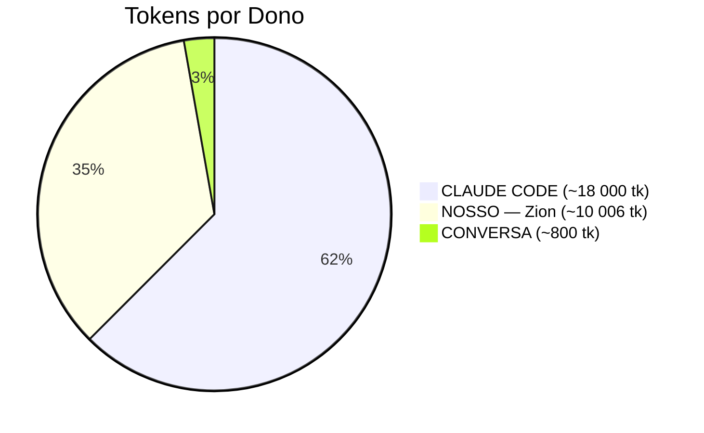
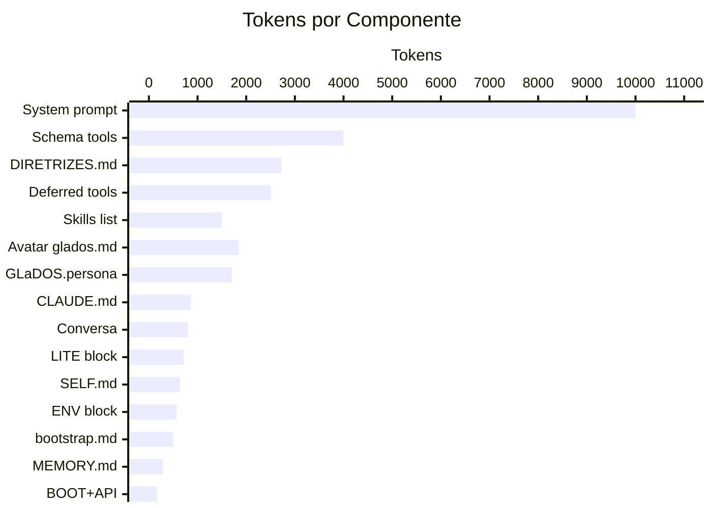
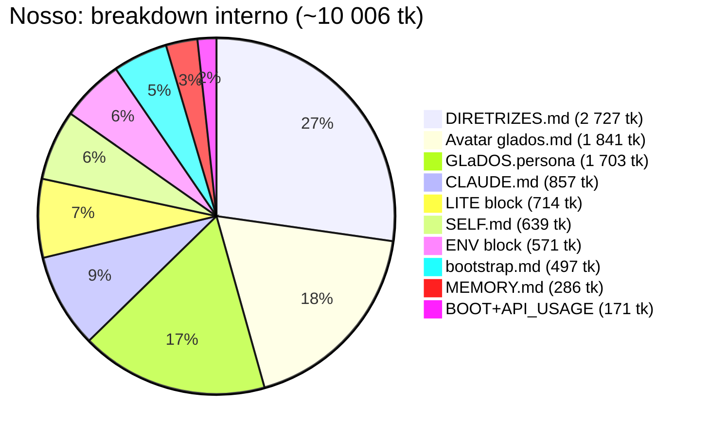

# Token Analysis — Sessão Atual (2026-03-19)

```mermaid
pie title Tokens por Dono
    "CLAUDE CODE (~18 000 tk)" : 18000
    "NOSSO — Zion (~10 006 tk)" : 10006
    "CONVERSA (~800 tk)" : 800
```

---

## Breakdown por Componente

```mermaid
xychart-beta horizontal
    title "Tokens por Componente"
    x-axis ["System prompt", "Schema tools", "DIRETRIZES.md", "Deferred tools", "Skills list", "Avatar glados.md", "GLaDOS.persona", "CLAUDE.md", "Conversa", "LITE block", "SELF.md", "ENV block", "bootstrap.md", "MEMORY.md", "BOOT+API"]
    y-axis "Tokens" 0 --> 11000
    bar [10000, 4000, 2727, 2500, 1500, 1841, 1703, 857, 800, 714, 639, 571, 497, 286, 171]
```

---

## Breakdown NOSSO — detalhe

```mermaid
pie title Nosso: breakdown interno (~10 006 tk)
    "DIRETRIZES.md (2 727 tk)" : 2727
    "Avatar glados.md (1 841 tk)" : 1841
    "GLaDOS.persona (1 703 tk)" : 1703
    "CLAUDE.md (857 tk)" : 857
    "LITE block (714 tk)" : 714
    "SELF.md (639 tk)" : 639
    "ENV block (571 tk)" : 571
    "bootstrap.md (497 tk)" : 497
    "MEMORY.md (286 tk)" : 286
    "BOOT+API_USAGE (171 tk)" : 171
```
