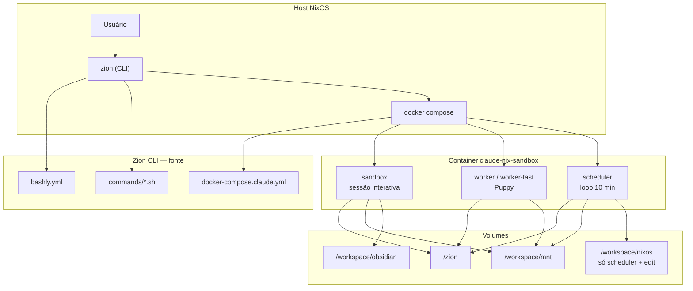

# Estrutura Zion + Zion CLI

---

## Resumo

| Camada | O quê |
|--------|--------|
| **Zion** | Nome do sistema: agentes, container, CLI, bootstrap, skills. Código em `zion/`. |
| **Zion CLI** | Binário `zion` (bashly). Fonte: `zion/cli/src/bashly.yml` + `zion/cli/src/commands/*.sh`. Regenerar com `bashly generate`. |
| **Compose** | `zion/cli/docker-compose.claude.yml` — imagem `claude-nix-sandbox`, serviços sandbox (sessão), worker, scheduler. |
| **sandbox** | Sessão interativa (Cursor/Claude). `network_mode: host`. Volumes base: zion, mnt, obsidian. |
| **worker** | Puppy: `puppy-runner.sh`. Tasks do kanban. |
| **scheduler** | Loop 10 min, `puppy-scheduler.sh`. Único com `/workspace/nixos` montado. |
| **zion edit** | Mesmo sandbox com mnt = repo NixOS e `/workspace/logs` (journal). |
