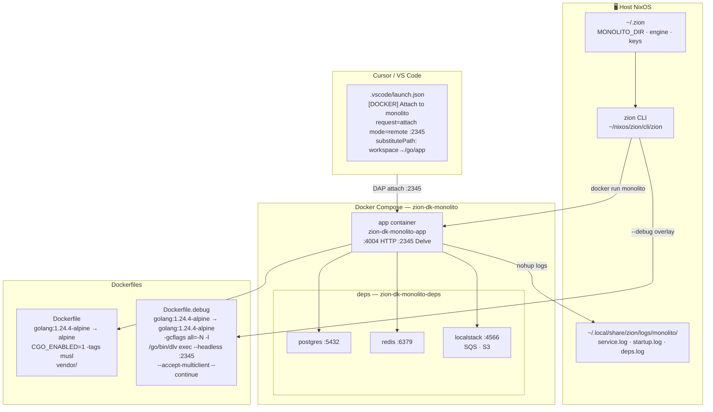
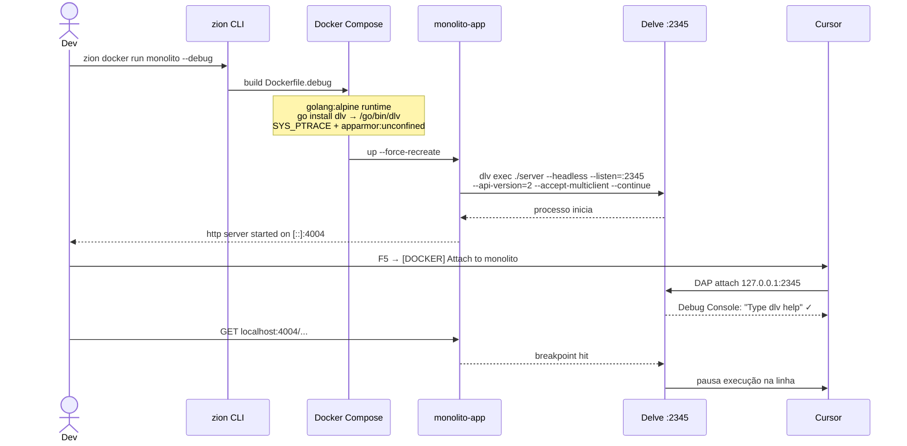
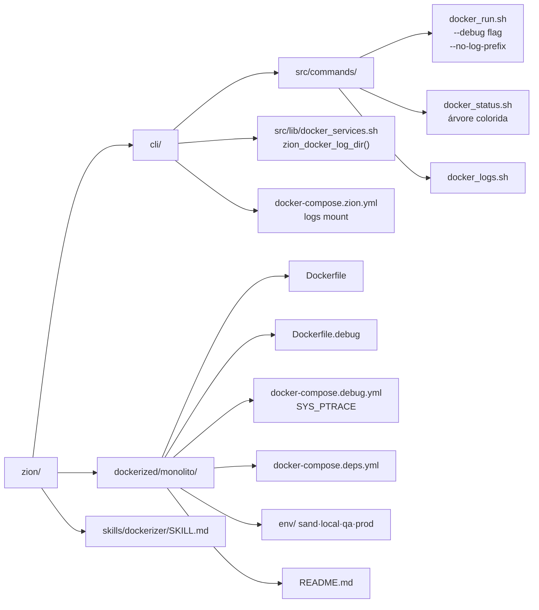

# Arquitetura Docker — Monolito Estratégia

---

## Fluxo — modo debug

---

## Estrutura de arquivos no repo

---

## Mapeamento de portas e logs

| Container | Porta host | Porta container | Log |
|-----------|-----------|-----------------|-----|
| monolito-app | :4004 | :4004 | service.log |
| monolito-app (debug) | :2345 | :2345 | service.log |
| monolito-postgres | :5432 | :5432 | deps.log |
| monolito-redis | :6379 | :6379 | deps.log |
| monolito-localstack | :4566 | :4566 | deps.log |

**Logs no container (zion edit):** `/workspace/logs/docker/monolito/`
**Logs no host:** `~/.local/share/zion/logs/monolito/`
