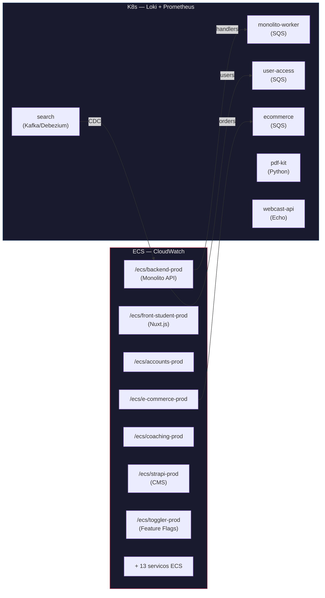
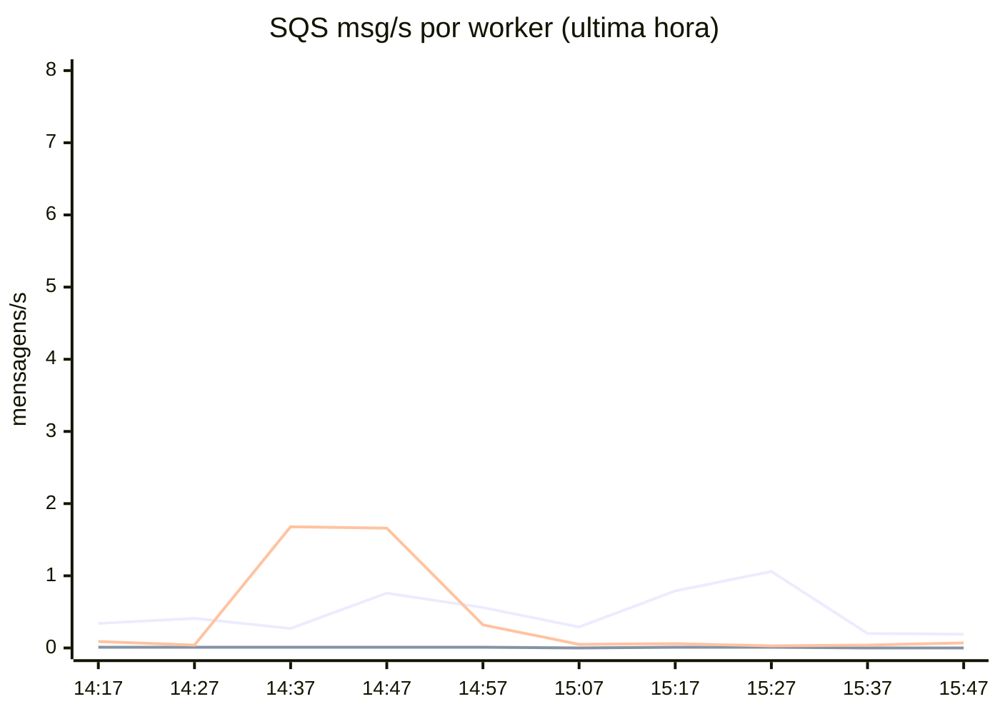
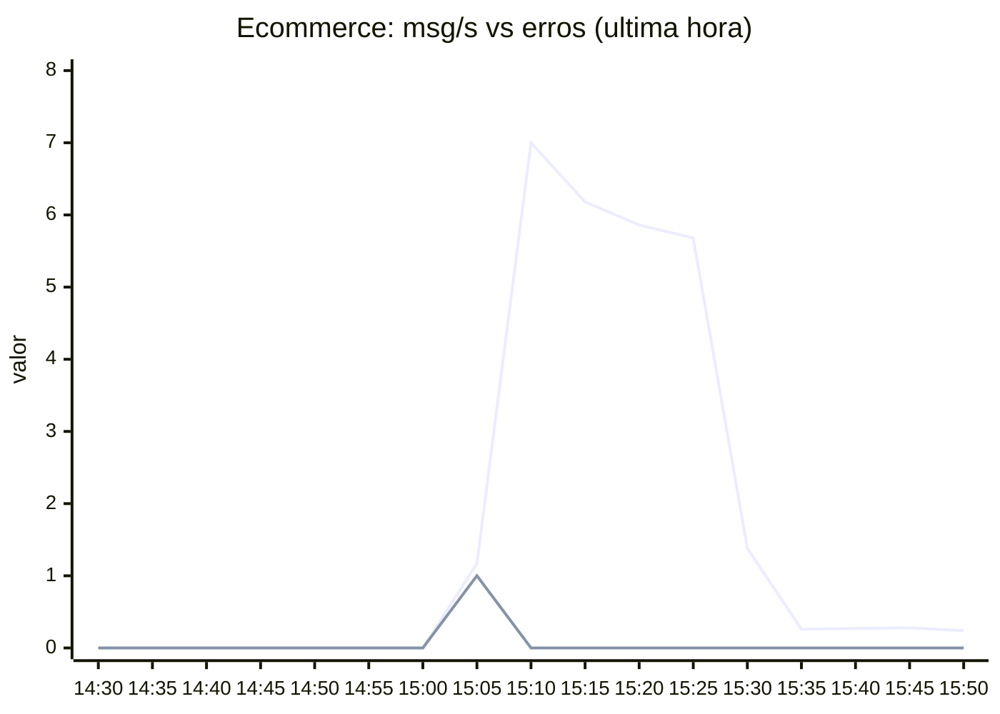
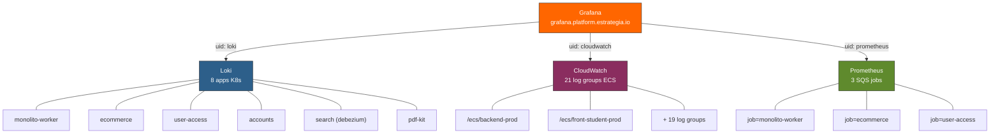

# Grafana — Estrategia Overview (18/03/2026)

> Dados coletados via MCP Grafana. Última hora de métricas Prometheus + 2h de erros Loki.

---

## Infraestrutura Híbrida

---

## SQS Workers — Taxa de Mensagens (ultima hora)

### Observacoes SQS

| Worker | Padrao | Rate medio | Pico |
|--------|--------|-----------|------|
| **monolito-worker** | Constante, com ondas | ~0.4 msg/s | 1.1 msg/s |
| **user-access** | Batches periodicos | ~0.3 msg/s | 2.17 msg/s |
| **ecommerce** | Baixo, spike recente | ~0.01 msg/s | **7.0 msg/s** (15:07!) |

> **Spike ecommerce**: as ~15:07 UTC o ecommerce saltou de 0 para **7 msg/s** durante ~5min, depois caiu para ~0.27 msg/s. Possivel batch de pedidos ou reprocessamento.

---

## Erros nos Workers K8s (Loki, ultimas 2h)

```mermaid
xychart-beta
    title "Erros por worker (count a cada 5min)"
    x-axis ["13:00","13:05","13:15","13:30","13:35","13:55","14:00","14:05","14:15","14:30","14:35","14:45","14:50","15:00","15:05"]
    y-axis "erros" 0 --> 13
    bar "monolito-worker" [3, 3, 12, 6, 3, 6, 6, 3, 0, 3, 0, 0, 0, 0, 0]
    bar "ecommerce" [0, 0, 0, 8, 0, 0, 0, 0, 1, 3, 0, 0, 0, 1, 9]
    bar "user-access" [1, 0, 1, 1, 1, 1, 0, 1, 0, 1, 0, 1, 0, 1, 1]
```

### Resumo de erros (2h)

| Worker | Total erros | Padrao |
|--------|-------------|--------|
| **monolito-worker** | 45 | Concentrados 13:00-14:05, depois zerou |
| **ecommerce** | 22 | Dois clusters: 13:30 e 15:05 (correlaciona com spike SQS) |
| **user-access** | 10 | 1 erro/intervalo — ruido de fundo constante |

> O monolito-worker parou de gerar erros na ultima hora. Os erros eram `AuditLogRepository.log: User ID is empty` — consistente, nao critico.

---

## Spike Ecommerce — Correlacao SQS x Erros

> O spike de 7 msg/s no ecommerce nao gerou muitos erros — processamento saudavel. O cluster de 9 erros as 15:05 veio logo antes do spike, possivelmente mensagens com payload invalido que precederam o batch.

---

## Dashboards Disponiveis

| Dashboard | UID | Datasource | O que monitora |
|-----------|-----|-----------|----------------|
| **ECS Logs** | `cehsqeou8rtvke` | CloudWatch | Panics + erros em 21 servicos ECS |
| **SQS Worker** | `fekhajb8lmg3kc` | Prometheus | Metricas SQS: latencia, rate, WIP |
| **Erros nos Workers** | `bea6645xc1beoa` | Loki | K8s workers: accounts, ecommerce, monolito-worker, pdf-kit |
| **Worker Search** | `be63427ypdloga` | Prometheus | Latencia por flow_key, taxa de sucesso |
| **Kafka Metrics** | `rrE2HgHVz` | Prometheus | Kafka metrics do search-worker |
| **Search** | `be08t0ld8sq9sc` | — | Dashboard principal do search |
| **Falhas em Pods** | `aujpjhs` | K8s | Pod failures geral |

---

## Datasources Verificados

---

*Skill `estrategia/grafana` reescrita e verificada — todos os labels, UIDs e queries confirmados via MCP.*
