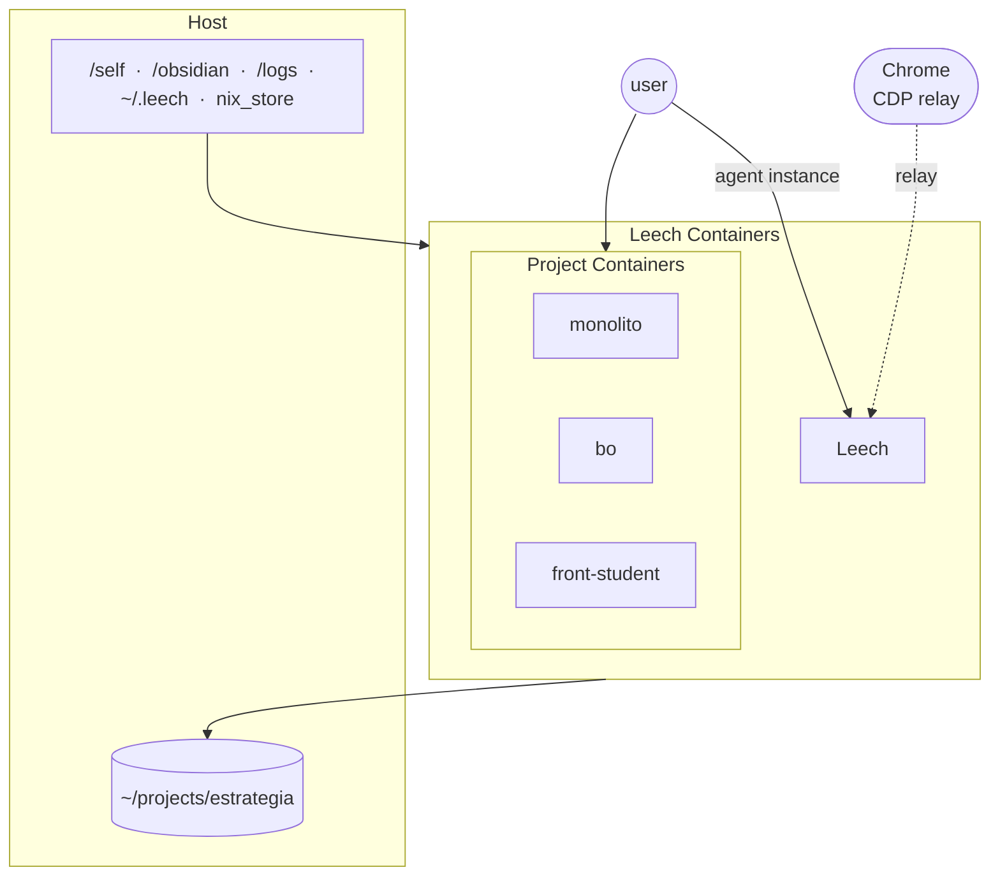

# NixOS + Leech

Flake-based NixOS configuration for an ASUS Zephyrus G14 (AMD Ryzen + NVIDIA RTX 4060 mobile), with Leech (agent launcher + container) and Puppy workers (background task runners).

## Architecture



## Structure

```
flake.nix            # Flake inputs and nixosConfigurations.nomad output
configuration.nix    # Module registry (enable/disable features here)
hardware.nix         # Partition UUIDs (local-only, git skip-worktree'd)

modules/
  core/              # Essential modules (kernel, nix, packages, services, shell, fonts, hibernate)
  hyprland.nix       # Hyprland compositor (active DE)
  nvidia.nix         # NVIDIA PRIME offload (AMD iGPU as default)
  asus.nix           # ASUS-specific hardware support
  greetd.nix         # Login greeter
  bluetooth.nix      # Bluetooth
  plymouth.nix       # Boot splash
  steam.nix          # Gaming
  ai.nix             # AI tools
  podman.nix         # Containers
  logiops.nix        # Logitech mouse config
  work.nix           # Work-related setup
  virt.nix           # Virtualization

stow/                # Dotfiles managed with GNU stow (symlinked into ~)
  .config/           # App configs (hypr, waybar, zed, ghostty, rofi, etc.)
  .claude/           # Claude Code skills, commands, settings

projetos/            # Work projects (mounted submódules, separate repos)
  CLAUDE.md          # Work mode switch (FERIAS/TRABALHO)

scripts/
  puppy-runner.sh     # Puppy: autonomous task runner (frontmatter-aware)
  api-usage.sh       # Anthropic API usage query

artefatos/           # Non-markdown outputs (binaries, exports, generated data)

obsidian/               # Obsidian vault (dashboard + communication)
  _agent/            # Agent area (versioned inside Obsidian)
    tasks/           # Autonomous task system
      recurring/     # Immortal tasks (run hourly, return to queue)
      pending/       # One-shot tasks (run once → done/failed)
      running/       # Currently executing (gitignored)
      done/          # Completed (gitignored)
      failed/        # Failed (gitignored)
    reports/         # Task-generated reports and analysis (gitignored)
  dashboard.md       # Auto-generated by runner
  sugestoes/         # Agent→user communication channel

.ephemeral/          # Ephemeral memory (gitignored)
  notes/<task>/      # Per-task context, logs, artifacts
  usage/             # Monthly usage JSONL
  health.json        # Health endpoint for Waybar
```

## CLAUDINHO (Autonomous Agent)

CLAUDINHO is an AI assistant running in a Docker container (`nixos/nix:latest`). It operates in two modes:

- **Interactive** (`make sandbox`) — personal dev assistant for NixOS config, dotfiles, work projects
- **Autonomous** — one long-running **scheduler** container (tick every 10 min in-container); `make auto` runs tasks headless for manual/cron. Host: `systemctl start claude-scheduler-container` to start the scheduler container.

### Task System

Each task has a `CLAUDE.md` with frontmatter:

```yaml
---
timeout: 300      # seconds (default: 300 recurring, 900 pending)
model: haiku      # haiku or sonnet (default: haiku recurring, sonnet pending)
schedule: always  # always (24/7) or night (00h-06h only)
mcp: false        # enable MCP servers (Jira/Notion)
---
```

### Quick Start

```sh
make doctor          # Full health check
make status          # Show task queue and recent executions
make run             # Run all tasks with live output
make auto            # Run tasks headless (manual; recurring = scheduler container)
make new name=x      # Create new task (wizard)
make vault-link      # Symlink Obsidian to ~/.obsidian/Work for Obsidian
make ping            # Health JSON for Waybar integration
```

## Flake Inputs

- **nixpkgs**: NixOS 25.11 (stable)
- **nixpkgs-unstable**: unstable channel (available as `unstable` in modules)
- **chaotic**: CachyOS kernel
- **hyprland**: pinned to v0.54.0
- **nixos-hardware**: ASUS Zephyrus hardware support
- **zen-browser**, **zed**, **isd**, **voxtype**, **nixified-ai**, **antigravity-nix**

## NixOS Commands

```sh
# Apply configuration
sudo nixos-rebuild switch --flake .#nomad

# Build without switching (test for errors)
sudo nixos-rebuild build --flake .#nomad

# Update all flake inputs
nix --extra-experimental-features 'nix-command flakes' flake update

# Apply dotfiles
stow -d ~/nixos/stow -t ~ .
```

## Tips

**hardware.nix is a template** — contains local partition UUIDs, excluded via skip-worktree:

```sh
git update-index --skip-worktree hardware.nix      # default
git update-index --no-skip-worktree hardware.nix   # temporarily unskip
```

**Nix superpowers** — any package from Nixpkgs available on-demand without installing:

```sh
nix-shell -p ffmpeg    # use ffmpeg temporarily
nix-shell -p python3   # quick python session
```

**High idle power draw?** NVIDIA might be misbehaving. Check `sudo powertop`.
