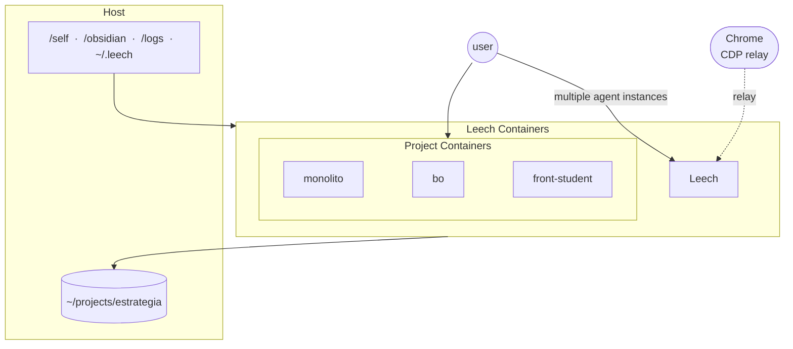

# NixOS + Leech

Flake-based NixOS configuration for an ASUS Zephyrus G14 (AMD Ryzen + NVIDIA RTX 4060 mobile), with Leech (agent launcher + container) and Puppy workers (background task runners).

## Architecture



## Structure

```
flake.nix            # Flake inputs and nixosConfigurations.nomad output
configuration.nix    # Module registry (enable/disable features here)
hardware.nix         # Partition UUIDs (local-only, git skip-worktree'd)

leech/               # Leech system (agent launcher + containers)
  bash/              # Bashly CLI source (leech command)
  docker/            # Docker compose files per service
    leech/           # Leech container + docker-proxy
    monolito/        # Monolito (Go API)
    bo-container/    # Bo (Vue/Quasar)
    front-student/   # Front-student (Nuxt)
    reverseproxy/    # Nginx reverse proxy
  rust/              # Rust CLI entry point
  self/              # Leech engine: skills, hooks, agents, scripts, commands

modules/             # NixOS modules
  core/              # Essential (kernel, nix, packages, services, shell, fonts)
  hyprland.nix       # Hyprland compositor
  nvidia.nix         # NVIDIA PRIME offload (AMD iGPU as default)
  asus.nix           # ASUS Zephyrus hardware support
  docker.nix         # Docker daemon
  leech-tick.nix     # systemd timer for leech tick

scripts/             # Host scripts (bootstrap, dashboards, utilities)

stow/                # Dotfiles managed with GNU stow (symlinked into ~)
  scripts/           # Shell scripts → ~/scripts
  assets/            # Wallpapers, icons
```

## Flake Inputs

- **nixpkgs**: NixOS 25.11 (stable)
- **nixpkgs-unstable**: unstable channel (available as `unstable` in modules)
- **chaotic**: CachyOS kernel
- **hyprland**: pinned to v0.54.0
- **nixos-hardware**: ASUS Zephyrus hardware support
- **zen-browser**, **zed**, **isd**, **voxtype**, **nixified-ai**, **antigravity-nix**

## Commands

```sh
leech switch         # Apply NixOS configuration (nh os switch)
leech switch test    # Build and test without switching
leech switch boot    # Apply on next boot
leech stow           # Deploy dotfiles (stow -d ~/nixos/stow -t ~ .)
leech update         # Regenerate Leech CLI (bashly generate)
leech man            # Full command reference

# Flake inputs
nix flake update     # Update all inputs
```

## Tips

**hardware.nix is a template** — contains local partition UUIDs, excluded via skip-worktree:

```sh
git update-index --skip-worktree hardware.nix      # default
git update-index --no-skip-worktree hardware.nix   # temporarily unskip
```

**Nix superpowers** — any package from Nixpkgs available on-demand without installing:

```sh
nix-shell -p ffmpeg    # use ffmpeg temporarily
nix-shell -p python3   # quick python session
```

**High idle power draw?** NVIDIA might be misbehaving. Check `sudo powertop`.
