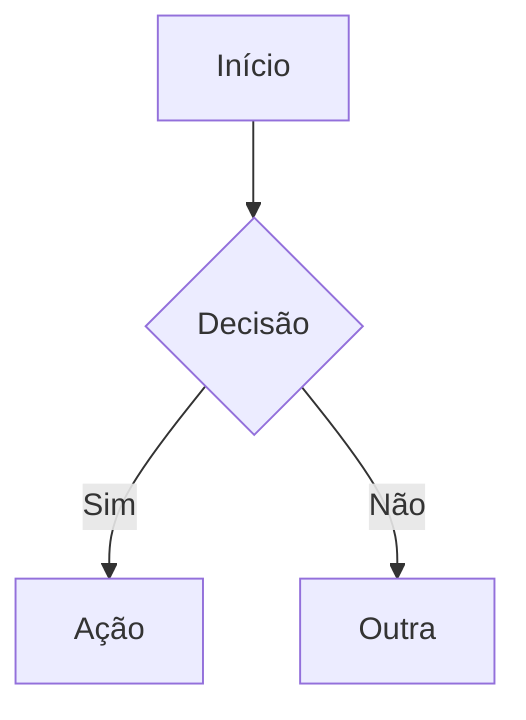

# Obsidian Reference — Plugins e Capacidades

## Plugins Instalados
| Plugin | ID | Função |
|--------|----|--------|
| Kanban | `obsidian-kanban` | Board de tasks (fonte de verdade) |
| Tasks | `obsidian-tasks-plugin` | Checkboxes com datas e recorrência |
| Rainbow Sidebar | `rainbow-colored-sidebar` | Visual |
| **Dataview** | `dataview` | Query engine — SQL-like sobre frontmatter YAML |
| **Templater** | `templater-obsidian` | Templates com JS (folder: `_templates/`) |
| **Homepage** | `homepage` | Abre `dashboard-home` ao iniciar o Obsidian |

## Dataview — Como usar nos arquivos do Obsidian

**Tabela com frontmatter:**
````markdown
```dataview
TABLE timeout, model, schedule
FROM "_agent/tasks/recurring"
WHERE file.name = "CLAUDE"
SORT model ASC
```
````

**Lista filtrada:**
````markdown
```dataview
LIST
FROM "sugestoes"
WHERE reviewed = false
SORT file.ctime DESC
```
````

**Inline query** (dentro de texto):
```markdown
Total: `= length(filter(pages("sugestoes"), (p) => p.reviewed = false))` não revisadas
```

**DataviewJS** (JavaScript inline):
```markdown
`$= dv.pages('"sugestoes"').where(p => p.reviewed === false).length`
```

**Operadores úteis:** `FROM "pasta"`, `WHERE campo = valor`, `SORT campo ASC/DESC`, `LIMIT N`, `GROUP BY campo`, `FLATTEN campo`

## Mermaid — Diagramas nativos
Obsidian renderiza Mermaid nativamente. Usar para arquitetura, fluxos, state machines:
````markdown

````
Tipos: `flowchart`, `graph`, `stateDiagram-v2`, `sequenceDiagram`, `gantt`, `pie`

## Templater — Templates em `_templates/`
- `nova-task.md` — template pra criar tasks (frontmatter + estrutura)
- Placeholders: `<% tp.file.title %>`, `<% tp.date.now("YYYY-MM-DD") %>`, `<% tp.file.cursor(1) %>`
- User cria nota via Templater (Ctrl+T) e seleciona template

## Dashboards disponíveis
| Arquivo | Conteúdo |
|---------|----------|
| `dashboard-home.md` | Homepage — tasks, links, sugestões recentes |
| `poc-task-analytics.md` | Analytics — distribuição modelo/schedule |
| `poc-suggestions-tracker.md` | Tracker — sugestões por categoria |
| `poc-nixos-modules.md` | Catálogo — módulos NixOS |
| `poc-mermaid-architecture.md` | Arquitetura — diagramas Mermaid |

## Ao criar conteúdo pro Obsidian
- **Sugestões**: SEMPRE incluir frontmatter (`date`, `category`, `reviewed: false`)
- **Reports**: podem ter frontmatter pra queries futuras
- **Novos dashboards**: usar Dataview queries, Mermaid pra diagramas
- **Novos templates**: criar em `obsidian/_templates/`, sintaxe Templater
