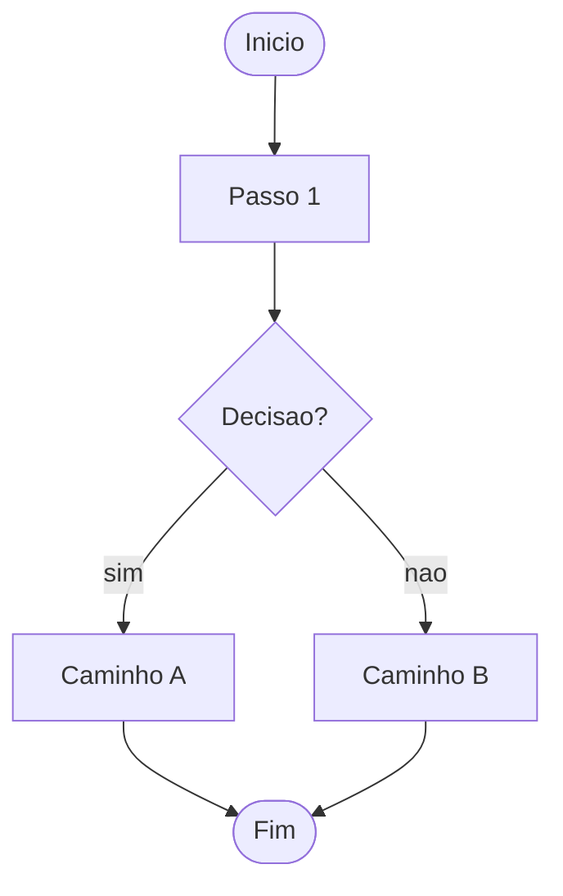

# Template: Flowchart Mermaid

Zoom + drag estao embutidos no relay. Basta usar `show` com um bloco mermaid.

## Como usar

```bash
# Criar o arquivo .md com o diagrama
cat > /tmp/meu-flow.md << 'EOF'
## Titulo do Flow


EOF

# Servir no holodeck
python3 /workspace/self/scripts/chrome-relay.py show /tmp/meu-flow.md
```

## Controles na tela

| Acao | Como |
|---|---|
| Zoom in/out | Scroll do mouse |
| Arrastar | Click + drag |
| Reset | Botao ⟳ (aparece no hover) |
| Pinch zoom | 2 dedos (touch) |

## Exemplo completo com estilos Catppuccin

```markdown
## Pipeline thinking/investigate

\`\`\`mermaid
%%{init: {'theme': 'dark'}}%%
flowchart TD
    A([🎫 Entrada]) --> B[Investigar]
    B --> C{Causa clara?}
    C -->|sim| D[code/debug]
    C -->|nao| E[brainstorm]
    E --> D

    style A fill:#cba6f7,color:#1e1e2e
    style D fill:#a6e3a1,color:#1e1e2e
    style E fill:#fab387,color:#1e1e2e
\`\`\`
```

## Dicas de estilo Mermaid

```
style NODE fill:#cba6f7,color:#1e1e2e    ← roxo (destaque)
style NODE fill:#a6e3a1,color:#1e1e2e    ← verde (sucesso/fim)
style NODE fill:#f38ba8,color:#1e1e2e    ← vermelho (erro)
style NODE fill:#fab387,color:#1e1e2e    ← laranja (warning)
style NODE fill:#89b4fa,color:#1e1e2e    ← azul (info)
```

## Flows salvos

Flows persistentes ficam em `obsidian/vault/diagrams/`.
