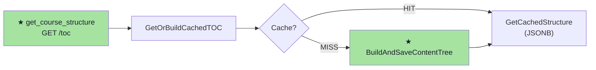

# code/analysis/flows — Diagrama de Fluxo Mermaid no Chrome

## Argumentos

```
/code:analysis:flows [--repo monolito|bo|front|all] [--modo leitura|escrita|full]
```

Defaults: `--repo all`, `--modo full`

## Templates

| Template | Quando usar |
|---|---|
| `templates/html.md` | Mermaid no Chrome (interativo, colorido) — default do `/code flows` |

Para Chrome: ler `templates/html.md` para o template HTML completo com Mermaid CDN e tema Catppuccin.
Para terminal: ler `skills/meta/art/ascii.md` (skill `/meta:art`) — fonte da verdade para todos os diagramas ASCII.

## Passo 1 — Detectar arquivos modificados

```bash
cd /workspace/home/estrategia/monolito/
git diff origin/main --name-only
```

Filtrar por camada:
- `apps/bff/` → BFF handlers (read path)
- `apps/bo/` → BO handlers (write path)
- `services/` → services
- `repositories/` → repositories/cache
- `workers/` → async workers
- `structs/` → shared types

## Passo 2 — Inferir nós do diagrama

Para cada arquivo modificado, extrair nome do nó:
- Handler BFF: nome do arquivo sem extensão, + rota do `@Router`
- Handler BO: nome do arquivo sem extensão
- Service: nome da func exportada principal
- Repository: nome da func exportada principal
- Worker: nome do handler de queue

**Nós novos** (status `A` no git diff) → marcar com `★` e cor verde.

## Passo 3 — Construir diagramas Mermaid

### Read Path (leitura)
```
BFF handler → service → cache check → [HIT: retorna cache] / [MISS: build → salva cache → retorna]
```

### Write Path (escrita)
```
BO handler → trigger service → SQS/queue → worker → build → salva cache
```

Exemplo de nós Mermaid gerado:


## Passo 4 — Renderizar no Chrome

Usar template de `templates/html.md`, substituindo os placeholders dos diagramas.

```bash
HTML=$(cat /tmp/flows_diagram.html | base64 -w 0)
python3 /workspace/self/scripts/chrome-relay.py nav "data:text/html;base64,${HTML}"
```

## Convenções visuais

| Elemento | Cor | Descrição |
|---|---|---|
| Nó novo (★) | `#a6e3a1` verde Catppuccin | Arquivo com status `A` no diff |
| Nó erro/conflito | `#f38ba8` vermelho | Erro detectado |
| Trigger/Queue | `#fab387` laranja | SQS, workers, events |
| Cache | `#89b4fa` azul | Redis, JSONB cache |
| Tema | Catppuccin Mocha dark | Sempre, sem exceção |
