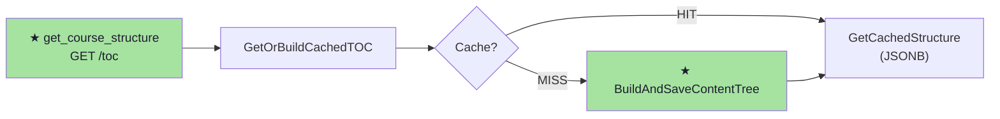

# Chrome — Visualizacoes via Relay

Precisa relay ativo. Verificar antes:
```bash
python3 /workspace/self/scripts/chrome-relay.py status 2>&1
```

---

## 1. Diagrama Mermaid (flowchart)

Template completo: `code/analysis/flows/templates/html.md`

- Tema Catppuccin Mocha dark
- Placeholders: `{{BRANCH_NAME}}`, `{{READ_PATH_DIAGRAM}}`, `{{WRITE_PATH_DIAGRAM}}`
- Cores: verde (novo), azul (cache), laranja (trigger/SQS), vermelho (erro)

Como gerar:
```bash
# Escrever HTML em /tmp/flows.html com diagrama Mermaid
HTML_B64=$(base64 -w 0 /tmp/flows.html)
python3 /workspace/self/scripts/chrome-relay.py nav "data:text/html;base64,${HTML_B64}"
```

Exemplo de diagrama Mermaid:


---

## 2. Arvore de Diff Interativa

Template completo: `code/analysis/diff/templates/interactive-tree.html`
Gerador Python: `code/analysis/diff/templates/generator.py`
Gerador por camada: `code/analysis/diff/templates/generator_by_layer.py`

Features:
- Pastas colapsaveis (click)
- Glow de ancestrais ao clicar num arquivo
- Breadcrumb sticky no topo
- Copy path ao clicar
- Tema Catppuccin Mocha dark

Placeholders: `{{BRANCH_NAME}}`, `{{REPO_NAME}}`, `{{TOTAL_FILES}}`, `{{TOTAL_A}}`, `{{TOTAL_M}}`, `{{TOTAL_D}}`, `{{TREE_HTML}}`

---

## 3. HTML Livre

Para qualquer visualizacao custom, gerar HTML e abrir:

```bash
# Gerar HTML em /tmp/custom.html
HTML_B64=$(base64 -w 0 /tmp/custom.html)
python3 /workspace/self/scripts/chrome-relay.py nav "data:text/html;base64,${HTML_B64}"
```

### Tema Catppuccin (copiar em qualquer HTML custom)

```css
:root {
  --ctp-base: #1e1e2e;      /* fundo */
  --ctp-mantle: #181825;     /* fundo secundario */
  --ctp-surface0: #313244;   /* bordas */
  --ctp-surface1: #45475a;   /* bordas hover */
  --ctp-text: #cdd6f4;       /* texto */
  --ctp-subtext0: #a6adc8;   /* texto secundario */
  --ctp-green: #a6e3a1;      /* novo/sucesso */
  --ctp-blue: #89b4fa;       /* cache/info */
  --ctp-peach: #fab387;      /* trigger/warning */
  --ctp-red: #f38ba8;        /* erro/blocker */
  --ctp-mauve: #cba6f7;      /* destaque/titulo */
  --ctp-yellow: #f9e2af;     /* atencao */
}
body {
  background: var(--ctp-base);
  color: var(--ctp-text);
  font-family: 'JetBrains Mono', 'Fira Code', monospace;
}
```

---

## Quando usar Chrome vs ASCII

| Criterio | ASCII | Chrome |
|----------|-------|--------|
| Tamanho | < 80 linhas | > 80 linhas |
| Interacao | nenhuma | collapse, hover, click |
| Velocidade | instantaneo | ~1s (relay) |
| Dependencia | nenhuma | relay ativo |
| Persistencia | some do terminal | fica na aba |
