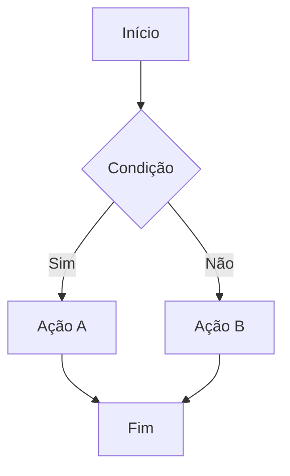
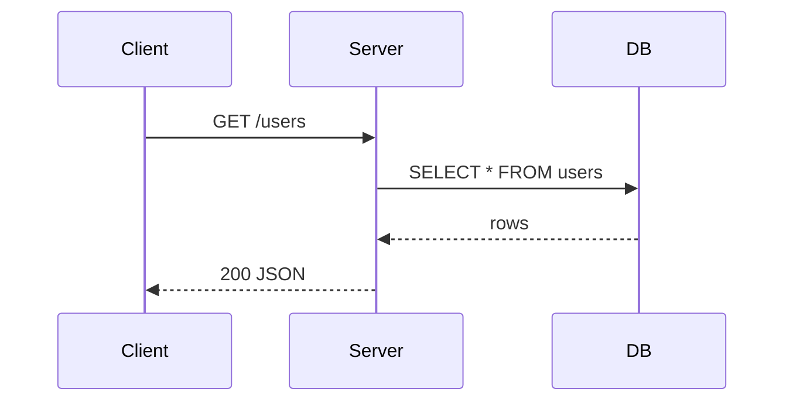
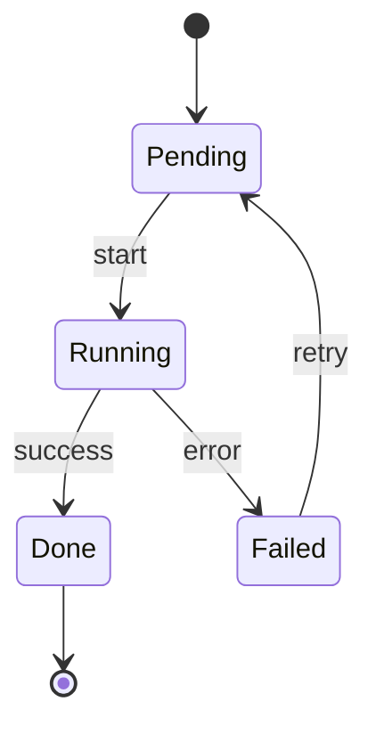
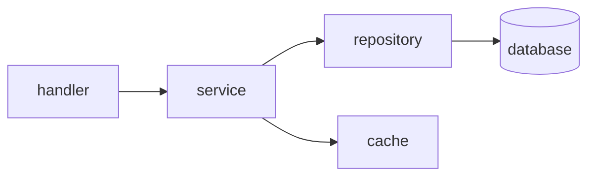
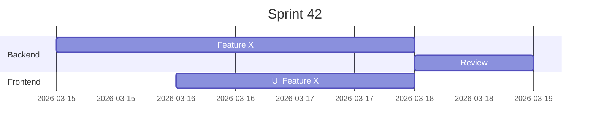
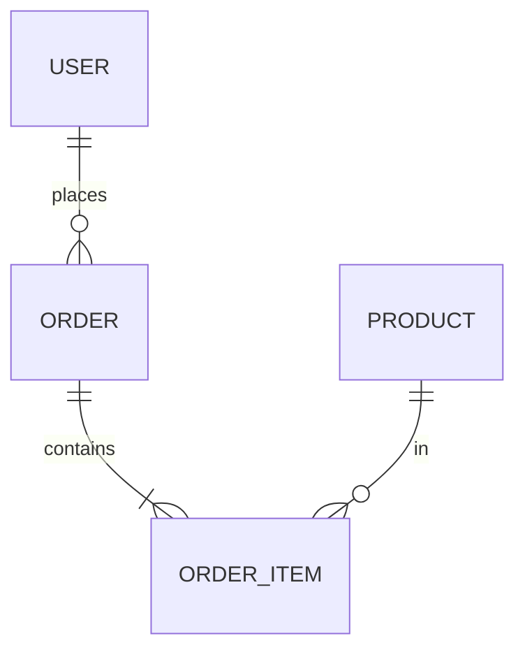

# Skill: draw — ASCII Art & Diagramas

> Referência para desenhar diagramas, fluxos, grafos e arquitetura.
> Decide automaticamente entre ASCII puro vs Mermaid conforme o contexto de renderização.

---

## Matriz de Renderização

| Contexto | ASCII/Box-drawing | Mermaid | Notas |
|----------|:-----------------:|:-------:|-------|
| **Claude Code terminal** | ✅ renderiza | ❌ não renderiza — mostra código bruto | Sempre usar ASCII no terminal |
| **Obsidian vault** | ✅ | ✅ renderiza nativamente | Preferir Mermaid pra diagramas complexos |
| **GitHub markdown** | ✅ | ✅ (desde 2022) | Mermaid funciona em `.md` no GitHub |
| **Claude.ai web** | ✅ | ✅ renderiza | Interface web renderiza Mermaid |
| **Arquivos `.md` locais** | ✅ | depende do viewer | Assumir que não renderiza, a menos que seja Obsidian/GitHub |

**Regra geral:**
- Interativo no terminal → **ASCII puro**
- Obsidian Obsidian / arquivo `.md` que vai pro GitHub → **Mermaid permitido**
- Dúvida sobre o contexto → perguntar ou usar ASCII (sempre funciona)

---

## ASCII — Referência de Padrões

### Caixas simples

```
┌─────────────┐    ╔═════════════╗    ╭─────────────╮
│  conteúdo   │    ║  conteúdo   ║    │  conteúdo   │
└─────────────┘    ╚═════════════╝    ╰─────────────╯
  simples             dupla              arredondada
```

### Fluxo linear

```
┌──────┐     ┌──────┐     ┌──────┐     ┌──────┐
│  A   │────▶│  B   │────▶│  C   │────▶│  D   │
└──────┘     └──────┘     └──────┘     └──────┘
```

### Fluxo com decisão (diamond)

```
              ┌──────┐
              │ START│
              └──┬───┘
                 │
              ┌──▼───┐
         ┌────│  ?   │────┐
         │ Sim└──────┘Não │
         ▼                ▼
      ┌──────┐        ┌──────┐
      │ Ação │        │ Skip │
      └──┬───┘        └──┬───┘
         └──────┬─────────┘
             ┌──▼───┐
             │ END  │
             └──────┘
```

### Grafo / Árvore

```
app
├── cmd/
│   └── main.go
├── internal/
│   ├── handler/
│   │   ├── user.go
│   │   └── auth.go
│   └── service/
│       └── user.go
└── pkg/
    └── util.go
```

### Tabela de dados

```
┌────────────┬──────────┬─────────┐
│ Campo      │ Tipo     │ Null    │
├────────────┼──────────┼─────────┤
│ id         │ bigint   │ NO      │
│ name       │ varchar  │ NO      │
│ created_at │ timestmp │ YES     │
└────────────┴──────────┴─────────┘
```

### Sequência/Timeline

```
 t=0         t=1         t=2         t=3
  │           │           │           │
  ├──[init]──▶├──[load]──▶├──[proc]──▶├──[done]
  │           │           │           │
```

### Seta estilo de comunicação (request/response)

```
Client          Server          DB
  │──── GET /──────▶│            │
  │                 │──── SQL ──▶│
  │                 │◀─── rows ──│
  │◀──── 200 ───────│            │
```

### Barra de progresso

```
[████████████████░░░░]  80%
[████████░░░░░░░░░░░░]  40%
[░░░░░░░░░░░░░░░░░░░░]   0%
```

### Pipeline horizontal

```
┌─────┐   ┌─────┐   ┌─────┐   ┌─────┐
│ SRC │──▶│ ETL │──▶│ DB  │──▶│ API │
└─────┘   └─────┘   └─────┘   └─────┘
```

### Layers/camadas

```
╔══════════════════════════╗
║         API Layer        ║
╠══════════════════════════╣
║       Service Layer      ║
╠══════════════════════════╣
║     Repository Layer     ║
╠══════════════════════════╣
║        Database          ║
╚══════════════════════════╝
```

### Grid/Matrix

```
     A    B    C    D
  ┌────┬────┬────┬────┐
1 │ ✓  │    │ ✓  │    │
  ├────┼────┼────┼────┤
2 │    │ ✓  │    │ ✓  │
  ├────┼────┼────┼────┤
3 │ ✓  │ ✓  │    │    │
  └────┴────┴────┴────┘
```

### Estado/Badge inline

```
● online     ○ offline     ◐ parcial
▲ warning    ✗ error       ✓ ok
```

---

## Mermaid — Referência (Obsidian / GitHub / Web)

### Flowchart

````markdown

````

### Sequência (request/response)

````markdown

````

### State Machine

````markdown

````

### Grafo de dependências

````markdown

````

### Gantt / Timeline

````markdown

````

### ER Diagram

````markdown

````

---

## Caracteres Úteis

| Categoria | Chars |
|-----------|-------|
| Box simples | `─ │ ┌ ┐ └ ┘ ├ ┤ ┬ ┴ ┼` |
| Box duplo | `═ ║ ╔ ╗ ╚ ╝ ╠ ╣ ╦ ╩ ╬` |
| Box arredondado | `╭ ╮ ╰ ╯` |
| Setas | `→ ← ↑ ↓ ↗ ↘ ↙ ↖ ▶ ◀ ▲ ▼` |
| Setas duplas | `⟶ ⟵ ⟷ ⇒ ⇐ ⇔` |
| Block chars | `█ ▓ ▒ ░ ▌ ▐ ▀ ▄` |
| Status | `● ○ ◐ ✓ ✗ ▲ ◆ ◇` |
| Triângulos | `▶ ▷ ▸ ▹ ◂ ◃ ◁ ◀` |
| Outros | `· • ‣ ⋮ ⋯ ⸺ — –` |

---

## Regras de Uso

1. **Contexto terminal sempre → ASCII**. Nunca usar Mermaid em respostas interativas do Claude Code.
2. **Mermaid para obsidian/docs** — ao criar arquivos `.md` pro Obsidian Obsidian ou GitHub, preferir Mermaid para diagramas complexos (sequência, ER, state machine).
3. **ASCII ≥ Mermaid** para coisas simples — uma caixa com setas é mais legível como ASCII do que como Mermaid de 3 linhas.
4. **Consistência de estilo** — usar box-drawing Unicode (não `+`, `-`, `|` ASCII puro) para melhor alinhamento visual.
5. **Code block obrigatório** — SEMPRE envolver diagramas ASCII em ` ```text ` ou ` ``` ` para preservar espaçamento monospace.

---

## Pitfalls & Anti-patterns

> Problemas reais observados em produção (screenshots 2026-03-15).

### Anti-pattern 1: Mix de estilos single + double (BREAKING)

**O que aparece:** borda direita com `║` enquanto o resto usa `─` e `┌┐└┘`. Canto incompatível.

```
❌  ┌────────────┐
    │ content    ║  ← single canto + double lateral = QUEBRADO
    └────────────╝

✅  ┌────────────┐    ╔════════════╗
    │ content    │    ║ content    ║
    └────────────┘    ╚════════════╝
    (tudo single)     (tudo double)
```

**Causa:** LLM muda de família de caracteres no meio da geração.

**Regra:** Decidir família UMA VEZ antes de começar. Se usou `┌`, usar `─ │ ┐ └ ┘ ├ ┤ ┬ ┴ ┼` até o fim. Se usou `╔`, usar `═ ║ ╗ ╚ ╝ ╠ ╣ ╦ ╩ ╬` até o fim.

---

### Anti-pattern 2: Borda direita duplicada (`│` extra ou `││`)

**O que aparece:** o lado direito da caixa tem dois pipes ou pipe largo.

```
❌  ┌──────────────┐
    │ item longo   ││  ← dois pipes! erro de contagem
    └──────────────┘

✅  ┌────────────────┐
    │ item longo     │  ← um pipe, largura calculada antes
    └────────────────┘
```

**Causa:** conteúdo mais longo que a largura planejada — LLM compensa com `│` extra.

**Regra:** Calcular largura ANTES. Pegar o texto mais longo, somar padding fixo (`1 espaço + conteúdo + 1 espaço`), usar esse valor para a linha `─`. Nunca recalcular por linha.

**Como calcular:**
```
Conteúdo mais longo: "cache-or-fetch" = 14 chars
Padding:              1 + 14 + 1      = 16 chars
Linha horizontal:     ─ × 16
Linha de conteúdo:    │ + " " + texto + padding_espaços + " " + │
Total por linha:      │ (1) + 16 + │ (1) = 18 chars
```

---

### Anti-pattern 3: Largura inconsistente entre linhas

```
❌  ┌──────────┐
    │ short    │
    ├───────────────────┤  ← linha mais larga! quebra o box
    │ muito mais content│
    └───────────────────┘

✅  ┌────────────────────┐  ← max width calculada uma vez
    │ short              │  ← padding com espaços até o limite
    ├────────────────────┤
    │ muito mais content │
    └────────────────────┘
```

**Regra:** Definir `MAX_WIDTH` globalmente. Todas as linhas horizontais têm exatamente esse tamanho. Linhas de conteúdo preenchem com espaços.

---

### Anti-pattern 4: Conectores incompatíveis com o estilo

```
❌  ┌─────────┬──────┐
    │ A       │ B    │
    ╠═════════╬══════╣  ← conector double em box single!
    │ X       │ Y    │
    └─────────┴──────┘

✅  ┌─────────┬──────┐    ╔═════════╦══════╗
    │ A       │ B    │    ║ A       ║ B    ║
    ├─────────┼──────┤    ╠═════════╬══════╣
    │ X       │ Y    │    ║ X       ║ Y    ║
    └─────────┴──────┘    ╚═════════╩══════╝
```

**Regra:** Conectores internos herdam o estilo:
- Single externo (`┌┐└┘`) → internos single (`├ ┤ ┬ ┴ ┼`)
- Double externo (`╔╗╚╝`) → internos double (`╠ ╣ ╦ ╩ ╬`)

---

### Tabela de famílias (referência rápida)

| Posição | Single | Double | Rounded |
|---------|:------:|:------:|:-------:|
| Canto ↖ | `┌` | `╔` | `╭` |
| Canto ↗ | `┐` | `╗` | `╮` |
| Canto ↙ | `└` | `╚` | `╰` |
| Canto ↘ | `┘` | `╝` | `╯` |
| Horizontal | `─` | `═` | `─` |
| Vertical | `│` | `║` | `│` |
| T esquerdo | `├` | `╠` | — |
| T direito | `┤` | `╣` | — |
| T cima | `┬` | `╦` | — |
| T baixo | `┴` | `╩` | — |
| Cruz | `┼` | `╬` | — |

> Rounded usa `╭╮╰╯` nos cantos mas `─` e `│` nas linhas — é uma família especial (cantos arredondados + linhas single). Não misturar cantos rounded com double.

---

### Checklist antes de finalizar um box

```
[ ] Família escolhida e declarada mentalmente (single / double / rounded)?
[ ] Todos os cantos do mesmo grupo?
[ ] Todas as horizontais do mesmo grupo (─ ou ═)?
[ ] Todas as verticais do mesmo grupo (│ ou ║)?
[ ] Conectores internos do mesmo grupo?
[ ] Borda direita: apenas UM char por linha, nunca││?
[ ] Largura: mesma em todas as linhas horizontais?
[ ] Padding interno: só espaço U+0020, nunca ZWS U+200B?
```

---

## Learning Log

> Atualizar este log quando descobrir novo comportamento de renderização.

| Data | Descoberta | Contexto |
|------|-----------|----------|
| 2026-03-15 | Mermaid NÃO renderiza no Claude Code terminal — mostra código bruto | Investigação inicial |
| 2026-03-15 | Obsidian renderiza Mermaid nativamente (confirmado em obsidian-reference.md) | Obsidian Obsidian |
| 2026-03-15 | GitHub renderiza Mermaid em `.md` desde 2022 | GitHub |
| 2026-03-15 | Claude.ai web renderiza Mermaid | Interface web |
