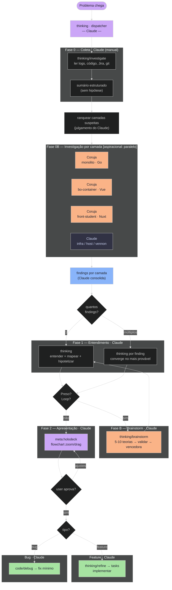

# Skill Chain — Como funciona

> Este documento descreve o comportamento real da skill chain, não o comportamento ideal.
> O que está marcado como **[aspiracional]** existe no diagrama mas não tem implementação automática hoje.

---

## Diagrama

---

## Como funciona hoje

### Fase 0 — Coleta (thinking/investigate)

Claude executa diretamente, sem agentes:
- Lê logs em `/workspace/logs/<app>/` (proativo, sem perguntar)
- Lê arquivos de código mencionados no erro ou relato
- Invoca `estrategia/jira` se há card Jira
- Roda `git log --oneline -20` para ver mudanças recentes
- Analisa screenshots se fornecidos
- Produz sumário estruturado sem formar hipótese

### Fase 0B — Dispatch por camada

**O que é possível hoje:** Claude pode invocar Coruja como subagente via Agent tool com `subagent_type: Coruja`. Pode fazer múltiplas chamadas em paralelo numa mesma mensagem.

**O que não é automático:** não existe gatilho que decide quando invocar Coruja. Claude decide com base no problema — se parece ser da estratégia (monolito/bo/front), pode invocar Coruja para investigar aquela camada.

**Na prática:** a maioria das investigações é feita pelo próprio Claude sem invocar Coruja. Coruja é invocada quando o problema requer expertise profunda de um repo específico ou quando Claude quer paralelizar camadas.

### Fase 1 — Entendimento (thinking)

Claude lê os findings, forma hipóteses, mapeia camadas e riscos. Se a mesma hipótese aparece duas vezes ou não há causa clara, invoca automaticamente `thinking/brainstorm`.

### Fase B — Brainstorm (thinking/brainstorm)

Gera 5-10 teorias, valida cada uma lendo arquivos/logs reais, classifica CONFIRMADA/REFUTADA/INCONCLUSIVA. Entrega 1 vencedor com evidência. Não para de gerar até ter evidência concreta.

### Fase 2 — Apresentação (meta:holodeck)

Claude gera um flowchart Mermaid via holodeck. O usuário valida antes de qualquer implementação.

### Fase 3 — Execução

- Bug com causa clara → `code/debug` (fix mínimo, sem reformatar)
- Feature/card → `thinking/refine` → backlog → implementar

---

## O que ainda não existe

| Item | Status | Notas |
|---|---|---|
| Ranking automático das "top 5 camadas" | Não existe | É julgamento do Claude baseado no problema |
| Dispatch automático de Coruja | Não existe | Claude decide manualmente quando invocar |
| Paralelização garantida de agentes | Não existe | Depende de Claude fazer múltiplas chamadas Agent na mesma mensagem |
| Detecção automática de loop no thinking | Parcial | Claude percebe por contexto, não por contador |
| Fallback de "todas as hipóteses refutadas" | Não existe | Claude para e pede mais info ao user |

---

## Quando invocar Coruja vs. Claude direto

Usar Coruja quando:
- O problema está claramente em monolito/bo-container/front-student
- A investigação requer conhecimento profundo de convenções do repo
- Vale paralelizar: o problema pode estar em múltiplos repos ao mesmo tempo

Usar Claude direto quando:
- O problema é de infra, vennon, NixOS ou host
- O contexto já está claro e só precisa de leitura rápida
- Overhead de subagente não vale para investigações simples
