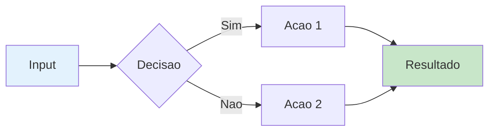
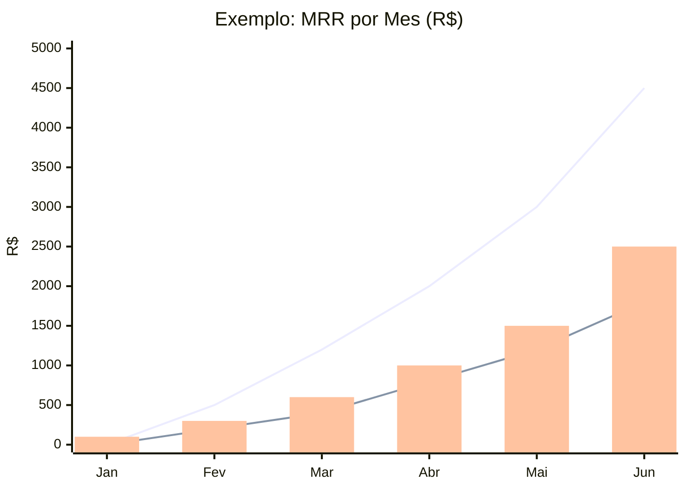
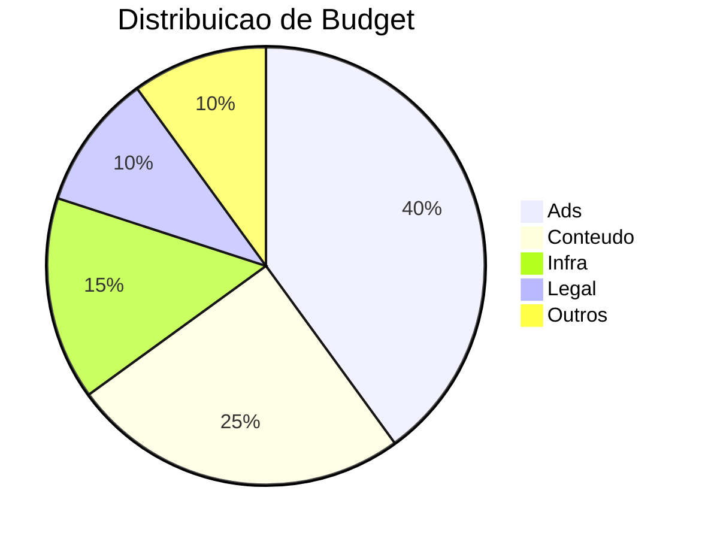
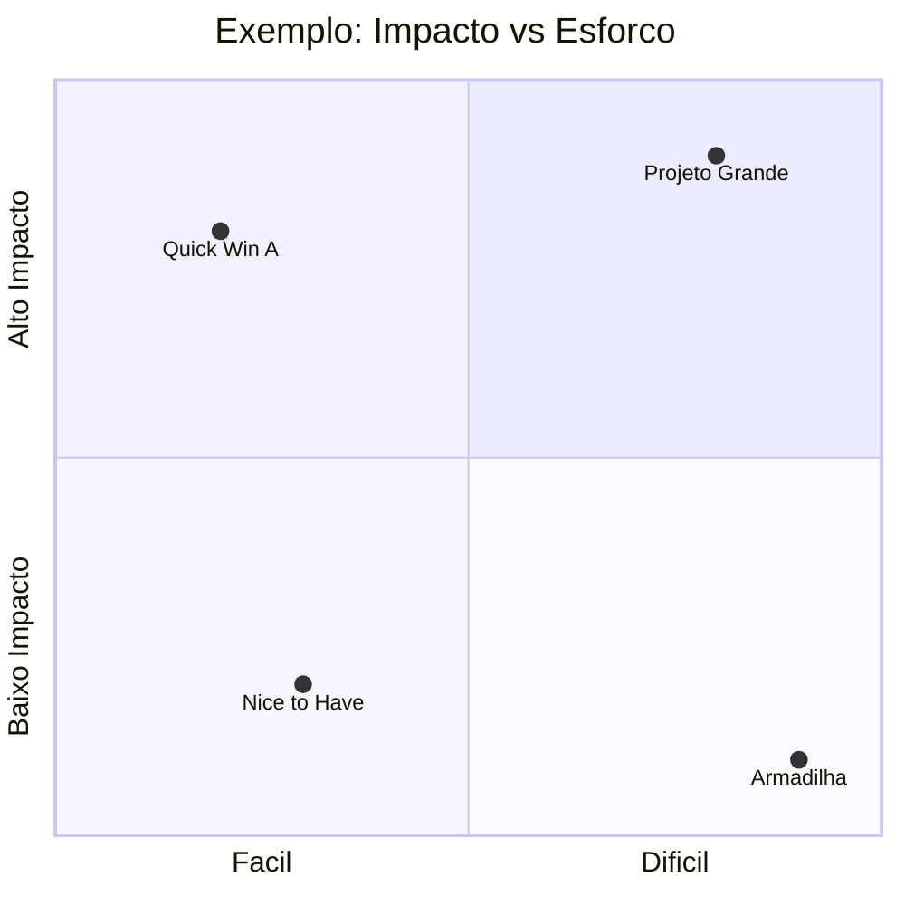
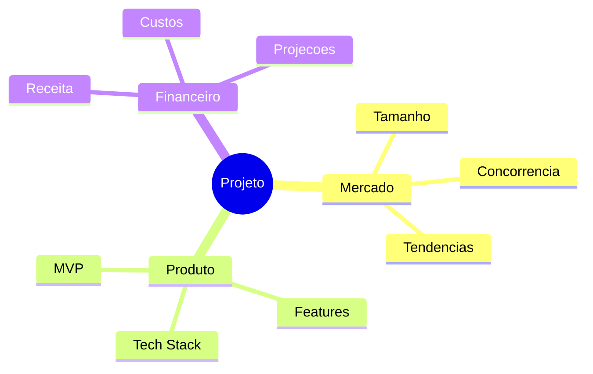
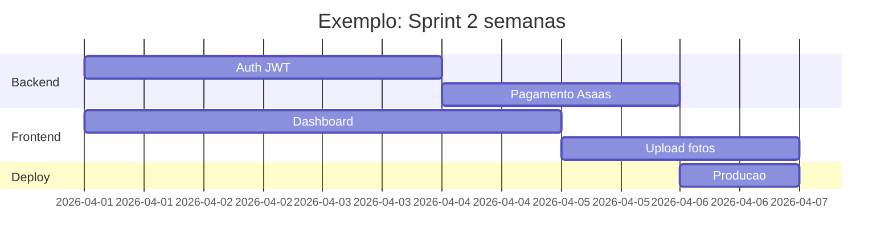
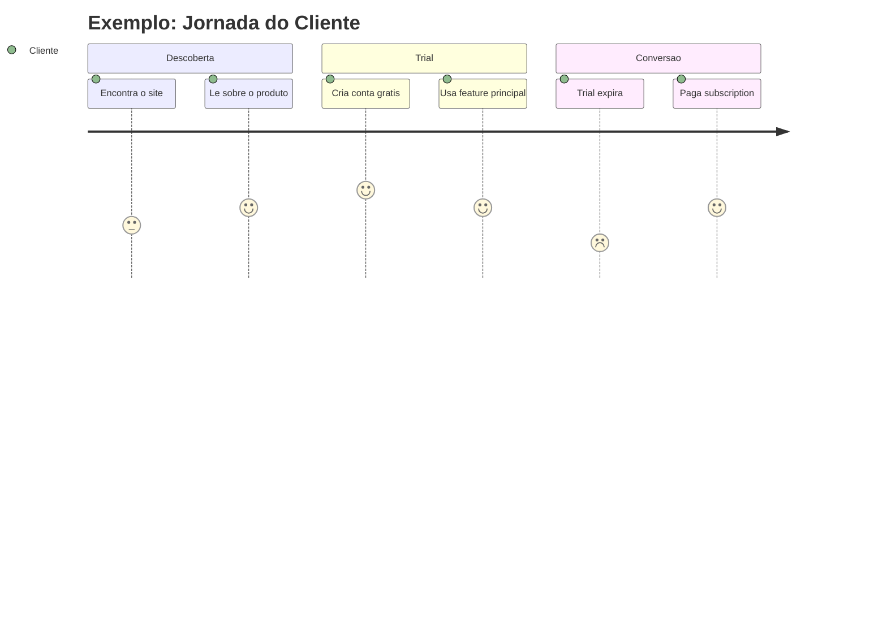
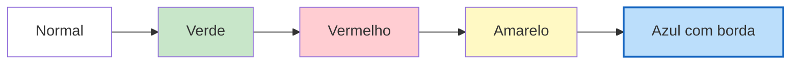

# Skill: meta/obsidian

> Tudo sobre o vault em `/workspace/obsidian/`.
> **Regras de interacao:** `self/superego/README.md` (entrypoint) → `self/superego/` (detalhe)

## Sub-skills

| Sub-skill | Arquivo | Quando usar |
|---|---|---|
| **rules** | `self/superego/` | Todas as regras do sistema — ver `/superego` |
| **graph** | `graph.md` | Manter o grafo Ctrl+G: frontmatter, related, hubs, wiseman |
| **dataview** | `dataview.md` | Queries Dataview/DataviewJS no dashboard e notas |

## Templates de output

### Relatorio de Inspecao

Template: `estrategia/orquestrador/pr-inspector/templates/report.md`

```
obsidian/artefacts/inspect-pr-<N>/
├── README.md     ← indice + frontmatter
└── report.md     ← relatorio completo
```

### Card de Agente (memory.md)

```yaml
---
name: <nome>-memory
type: agent-memory
updated: YYYY-MM-DDTHH:MMZ
---
```

### Feed

Append-only em `obsidian/inbox/feed.md`:
```
[HH:MM] [nome-agente] mensagem curta
```

## Mermaid Charts

Obsidian renderiza Mermaid nativamente dentro de blocos ` ```mermaid `.
Referencia completa: https://mermaid.js.org/

### Catalogo de Tipos (todos testados no Obsidian)

#### Fluxos e Arquitetura

| Tipo | Sintaxe | Quando usar | Exemplo |
|---|---|---|---|
| **Flowchart** | `graph TB` / `graph LR` | Fluxos, decisoes, arquitetura | Ecossistema de produto, pipeline de dados |
| **Subgraphs** | `subgraph "Nome"` dentro de graph | Agrupar componentes | Frontend vs Backend vs DB |
| **Sequence** | `sequenceDiagram` | Interacoes entre sistemas | API calls, webhooks, auth flow |
| **State** | `stateDiagram-v2` | Maquinas de estado | Lead stages, order lifecycle |
| **Class** | `classDiagram` | Modelos de dados, OOP | Schema de banco simplificado |
| **ER** | `erDiagram` | Relacoes entre entidades | Schema SQL com cardinalidade |



#### Graficos de Dados

| Tipo | Sintaxe | Quando usar | Exemplo |
|---|---|---|---|
| **Bar chart** | `xychart-beta` + `bar` | Rankings, comparativos, totais | Preco por bairro, custo por servico |
| **Line chart** | `xychart-beta` + `line` | Tendencias, projecoes, series | MRR ao longo do tempo, 3 cenarios |
| **Multi-line** | `xychart-beta` + multiplos `line` | Comparar cenarios | Otimista vs realista vs pessimista |
| **Bar + Line** | `xychart-beta` + `bar` + `line` | Valores absolutos + tendencia | Volume + taxa de conversao |
| **Pie** | `pie` | Distribuicao proporcional | Market share, alocacao de budget |





#### Posicionamento e Analise

| Tipo | Sintaxe | Quando usar | Exemplo |
|---|---|---|---|
| **Quadrant** | `quadrantChart` | Posicionamento 2D, prioridade | Impacto×Esforco, Preco×Completude, Risco×Probabilidade |
| **Mindmap** | `mindmap` | Brainstorm, taxonomia, visao geral | SWOT expandido, features do produto |





#### Timeline e Planejamento

| Tipo | Sintaxe | Quando usar | Exemplo |
|---|---|---|---|
| **Gantt** | `gantt` | Cronograma, roadmap, sprints | Roadmap 12 meses, GTM 8 semanas |
| **Timeline** | `timeline` | Eventos historicos, marcos | Historia do projeto, marcos de lancamento |



#### Experiencia do Usuario

| Tipo | Sintaxe | Quando usar | Exemplo |
|---|---|---|---|
| **Journey** | `journey` | Jornada do usuario, satisfacao por etapa | Onboarding, funil de conversao |



### Estilizacao



Cores uteis (Material Design):
- Verde (sucesso): `#c8e6c9`
- Vermelho (erro/critico): `#ffcdd2`
- Amarelo (atencao): `#fff9c4`
- Azul (info): `#bbdefb`, `#e3f2fd`
- Roxo (futuro): `#d1c4e9`
- Laranja (warning): `#ffe0b2`

### Boas Praticas

- **1 grafico por conceito** — nao sobrecarregar
- **Titulo sempre** — `title "..."` em xychart, titulo no texto em outros
- **Callout interpretativo** junto ao grafico (o que o leitor deve concluir)
- **Labels curtos** — usar `<br>` para quebrar linha dentro de nodes
- **Subgraphs** para agrupar (melhora legibilidade)
- **Cores** para destacar (verde=bom, vermelho=ruim, amarelo=atencao)
- **Links tracejados** `-.->` para conexoes futuras/opcionais
- **TB** (top-bottom) para hierarquias, **LR** (left-right) para fluxos
- **Combinar tipos** — journey para UX, gantt para timeline, xychart para dados, quadrant para posicionamento
- **Dark mode**: `%%{init: {'theme': 'dark'}}%%` na primeira linha do bloco

### Quando usar cada tipo (decisao rapida)

```
Preciso mostrar...
├── Fluxo/processo/decisao → graph TB/LR
├── Dados numericos ao longo do tempo → xychart-beta line
├── Comparacao de valores → xychart-beta bar
├── Distribuicao/proporcao → pie
├── Posicionamento 2D (X vs Y) → quadrantChart
├── Cronograma/roadmap → gantt
├── Jornada do usuario → journey
├── Brainstorm/taxonomia → mindmap
├── Relacoes entre entidades → erDiagram
├── Interacao entre sistemas → sequenceDiagram
└── Estados e transicoes → stateDiagram-v2
```

## Convencoes Obsidian

- Frontmatter YAML sempre no topo
- Datas em ISO 8601 UTC
- Links internos: `[[nome-do-arquivo]]`
- Tags: `#tag` no body, NAO no frontmatter
- `related:` no frontmatter para edges no graph
- Callouts: `[!example]+` leitura, `[!tip]+` insight, `[!warning]+` gaps
