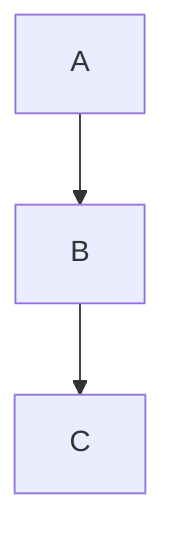

# buzz — Container→Host IPC

`buzz` é o daemon que roda no **host** e expõe actions via socket Unix.
Do container, basta chamar `buzz call <action>` — o daemon executa no host com as permissões do usuário.

**Socket:** `~/.vennon/buzz.sock` (já montado em todos os containers via `~/.vennon/`)

---

## Como chamar (dentro do container)

> **O binário `buzz` não está instalado no container.** Sempre usar Python via socket Unix diretamente.

```python
import socket, json

def buzz(action, **args):
    sock = socket.socket(socket.AF_UNIX, socket.SOCK_STREAM)
    sock.connect('/home/claude/.vennon/buzz.sock')
    req = json.dumps({'id': '1', 'action': action, 'args': args, 'source': 'claude'}) + '\n'
    sock.sendall(req.encode())
    resp = json.loads(sock.recv(65536).decode())
    sock.close()
    return resp
```

Uso inline:
```bash
python3 -c "
import socket, json
sock = socket.socket(socket.AF_UNIX, socket.SOCK_STREAM)
sock.connect('/home/claude/.vennon/buzz.sock')
sock.sendall((json.dumps({'id':'1','action':'relay-start','args':{},'source':'claude'})+'\n').encode())
print(sock.recv(4096).decode())
sock.close()
"
```

> `buzz call` / `buzz list` / `buzz status` são os comandos do **host**. Do container, sempre via socket Python.

---

## ★ Relay — O mais importante

O relay conecta o container ao Chrome via CDP (Chrome DevTools Protocol).
Use para mostrar qualquer coisa visual ao usuário: diagramas, HTML, dashboards.

### Fluxo obrigatório antes de usar

```bash
# 1. Verificar se o Chrome já está com CDP ativo
buzz call relay-status

# 2. Se não estiver: subir o Chrome
buzz call relay-start

# 3. Agora usar normalmente
```

### Comandos relay

```bash
# Navegar para uma URL
buzz call relay-nav --url=https://exemplo.com

# Mostrar arquivo markdown/HTML (com Mermaid, zoom+drag)
buzz call relay-show --path=/tmp/meu-diagrama.md

# Executar JavaScript no Chrome e capturar resultado
buzz call relay-inject --js="document.title"

# Listar abas abertas
buzz call relay-tabs

# Para o Chrome + relay
buzz call relay-stop
```

### Fluxo completo — mostrar algo no Chrome

```bash
# 1. Escrever o conteúdo
cat > /tmp/minha-viz.md << 'EOF'
# Título


EOF

# 2. Garantir Chrome ativo
buzz call relay-start

# 3. Exibir
buzz call relay-show --path=/tmp/minha-viz.md
```

> O relay serve arquivos de `/tmp/` automaticamente via HTTP em `:8765`.
> Para HTML livre: escreva em `/tmp/` e use `relay-nav` com `http://vennon:8765/<arquivo>.html`.

---

## Outras actions

### Apps

```bash
# Notificação no desktop do host
buzz call notify --message="Build concluído"

# Abrir arquivo no Zed
buzz call open-editor --path=~/projects/meu-app

# Abrir no VS Code
buzz call open-vscode --path=~/projects/meu-app

# Abrir URL no Chrome (janela normal, sem CDP)
buzz call open-chrome --url=https://exemplo.com
```

### Containers (read-only)

```bash
# Status de todos os containers vennon
buzz call podman-status

# Logs de um serviço
buzz call podman-logs --service=monolito --tail=50
# services válidos: monolito, bo-container, front-student, reverseproxy
```

---

## Paths — como montar caminhos para o host

O daemon roda no **host** (`/home/pedrinho`). Paths `~/` no buzz.yaml resolvem para o home do host, não do container.

| No container | No host (passar pro buzz) |
|---|---|
| `/workspace/projects/` | `/home/pedrinho/projects/` |
| `/workspace/host/` | `/home/pedrinho/nixos/` |
| `/workspace/self/` | `/home/pedrinho/nixos/vennon/self/` |
| `/tmp/arquivo.md` | `/tmp/arquivo.md` (igual) |

**Regra:** substituir `/workspace/projects/` por `/home/pedrinho/projects/` ao montar o path para `open-editor`, `open-vscode`, `relay-show`, etc.

```python
# Converter path do container para path do host
def container_to_host(path):
    return path.replace('/workspace/projects/', '/home/pedrinho/projects/') \
               .replace('/workspace/host/', '/home/pedrinho/nixos/')
```

---

## Validações (o daemon rejeita se violar)

| Action | Restrição |
|--------|-----------|
| `open-editor`, `open-vscode` | path deve estar dentro de `~/projects` ou `~/nixos` |
| `open-chrome` | URL deve começar com `https://` |
| `relay-nav` | URL deve começar com `http` |
| `relay-show` | path deve estar em `~/projects`, `~/nixos` ou `/tmp` |
| `relay-inject` | JS máximo 5000 chars |
| `notify` | mensagem máximo 500 chars |
| `podman-logs` | service deve ser um dos 4 conhecidos |

Se negado, o daemon retorna `status: denied` com o motivo.

---

## Quando o daemon não está rodando

```bash
buzz status   # confirma: "buzz not running"
```

No host: `systemctl --user start buzz` ou `systemctl --user enable --now buzz`.

O serviço é gerenciado por `~/.config/systemd/user/buzz.service` (stow).
Config em `~/.config/vennon/buzz.yaml` — relida a cada request, sem restart necessário.
