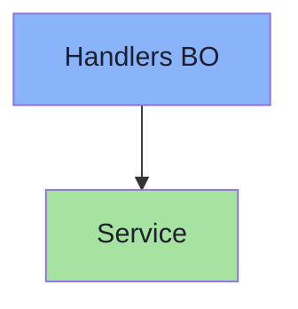
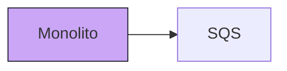
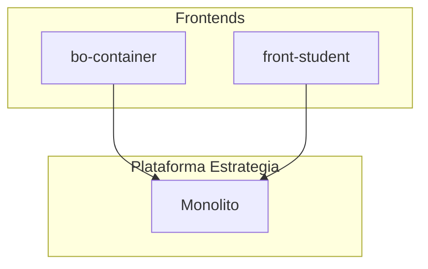

# Mermaid — estilo global (referência vennon)

Conteúdo **transversal** a todos os tipos de diagrama: tema, cores, classes CSS, inicialização e limites. Os exemplos por tipo estão em `template/*.md`.

## Onde o tema já está definido

O `base.html` canónico chama `mermaid.initialize({ theme: 'dark', themeVariables: { ... } })` — ver `skills/webview/mermaid/base.html`. Diagramas copiados para o live **herdam** esse tema; podes ainda prefixar o diagrama com `%%{init: ...}%%` para um diagrama específico.

## `%%{init}%%` no topo do diagrama

Ajuste pontual sem alterar o HTML:

```text
%%{init: {'theme': 'dark', 'themeVariables': { 'primaryColor': '#7c3aed' }}}%%
flowchart LR
  A --> B
```

Útil para testar **forest**, **neutral**, **base** ou variáveis documentadas em [Theme variables](https://mermaid.ai/open-source/config/theming.html).

## `classDef` e `class` (flowchart e similares)

Define estilos reutilizáveis e aplica por id de nó:



## `style` inline por nó



## Subgrafos

Agrupar por domínio ou equipa:



### Subgrafos — vários fluxos (segregar código / apps)

Para **separar visualmente** partes do sistema (repos, serviços, filas) e **ainda ligar** com setas, usa **um único** `flowchart` com **vários** `subgraph ... end`. Não há dois `flowchart` no mesmo bloco — o “segredo” é um grafo com clusters.

- **`subgraph ID["Rótulo"]`** — o `ID` (ex.: `FS`, `API`) serve para `style ID ...` e para leitura do diagrama.
- **`direction TB` ou `LR` dentro** do subgraph define o fluxo **interno**; o `flowchart LR`/`TB` **global** ajuda a colocar os blocos lado a lado ou em coluna.
- **Ligações entre fronteiras**: aresta entre **nós** de subgraphs diferentes, ex. `noFront --> noAPI`.
- **Estilo por caixa**: `style FS fill:#1e1e2e,stroke:#f5c2e7,stroke-width:2px` — bordas com cores distintas por app/camada.
- **Exemplo canónico Estrategia** (quatro blocos + fila): `template/flow-subgraphs.md`.

## Cores e acessibilidade

- Preferir contraste alto texto/fundo (ex.: Catppuccin Mocha: texto `#1e1e2e` em fills claros).
- Evitar depender só de cor para significado; usar **rótulos** nas setas.

## Imagens dentro de diagramas

- **Flowchart:** alguns renderizadores suportam `A[""]` — depende da versão e da política CSP do browser; **não é garantido** no relay.
- **Preferido:** ícones em `architecture-beta` via [Iconify](https://mermaid.ai/open-source/config/icons.html) (`group x(cloud)[Título]`) ou texto + emojis simples no rótulo.
- **Alternativa:** exportar **SVG** pelo botão do `base.html` e compor fora do Mermaid.

## Font Awesome / ícones em nós

Em **flowchart**, há suporte experimental a Font Awesome com prefixos como `fa:` — ver documentação atual do Mermaid; se falhar, usar texto.

## Diagramas “beta” e versão

Tipos `*-beta` e `architecture-beta` exigem Mermaid recente (CDN `mermaid.min.js` no `base.html`). Se algo não renderizar, verificar consola do browser e versão do bundle.

## ZenUML e outros plugins

Diagramas que dependem de **plugins** extra podem não estar registados no `base.html` padrão; usar `sequenceDiagram` nativo como substituto (ver `template/zenuml.md`).

## Links oficiais

- [Configuration](https://mermaid.ai/open-source/config/configuration.html)
- [Directives](https://mermaid.ai/open-source/config/directives.html)
- [Mermaid CLI / export](https://mermaid.ai/open-source/mermaid-cli.html) (fora do fluxo live)
