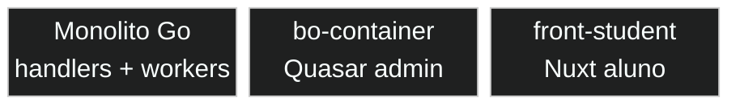

# Exemplo — Block diagram (referência)

## Para que serve neste contexto

| Uso | Papel |
|-----|--------|
| **Referência / cópia** | **Layout fixo** em colunas (evita surpresas do autolayout do flowchart); blocos compostos, formas variadas. |
| **Relay** | `diagram.mmd` + live. |

## Definição (resumo)

**block-beta** organiza blocos numa **grelha** (`columns N`), com span (`:N`), blocos aninhados e ligações. Documentação: [Block diagram](https://mermaid.ai/open-source/syntax/block.html).

## Diagrama de exemplo — Três frentes da plataforma



## Colar no `base.html` / live

Interior do bloco → `diagram.mmd`.

## Pré-visualização pontual (opcional)

```bash
python3 /workspace/self/scripts/chrome-relay.py show /workspace/self/skills/webview/mermaid/template/block.md
```

Ver `template/README.md`, `../styling-global.md`.
