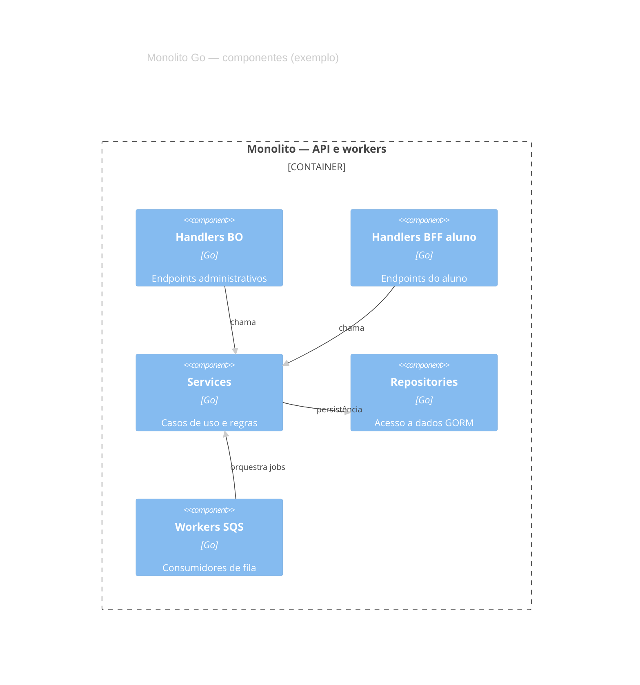

# Exemplo — C4 Component (referência)

## Para que serve neste contexto

| Uso | Papel |
|-----|--------|
| **Referência / cópia** | **Nível 3 C4**: **componentes** dentro de um container (ex.: camadas do monolito). |
| **Relay** | Ver `skills/webview/SKILL.md`. |

## Definição (resumo)

**C4Component** descreve **componentes** e relações no interior de um **container**. Documentação: [C4 diagrams](https://mermaid.ai/open-source/syntax/c4.html).

## Diagrama de exemplo — Monolito (camadas simplificadas)



## Colar no `base.html` / live

Interior do bloco → `diagram.mmd`.

## Pré-visualização pontual (opcional)

```bash
python3 /workspace/self/scripts/chrome-relay.py show /workspace/self/skills/webview/mermaid/template/c4-component.md
```

Ver `template/README.md`, `../styling-global.md`.
