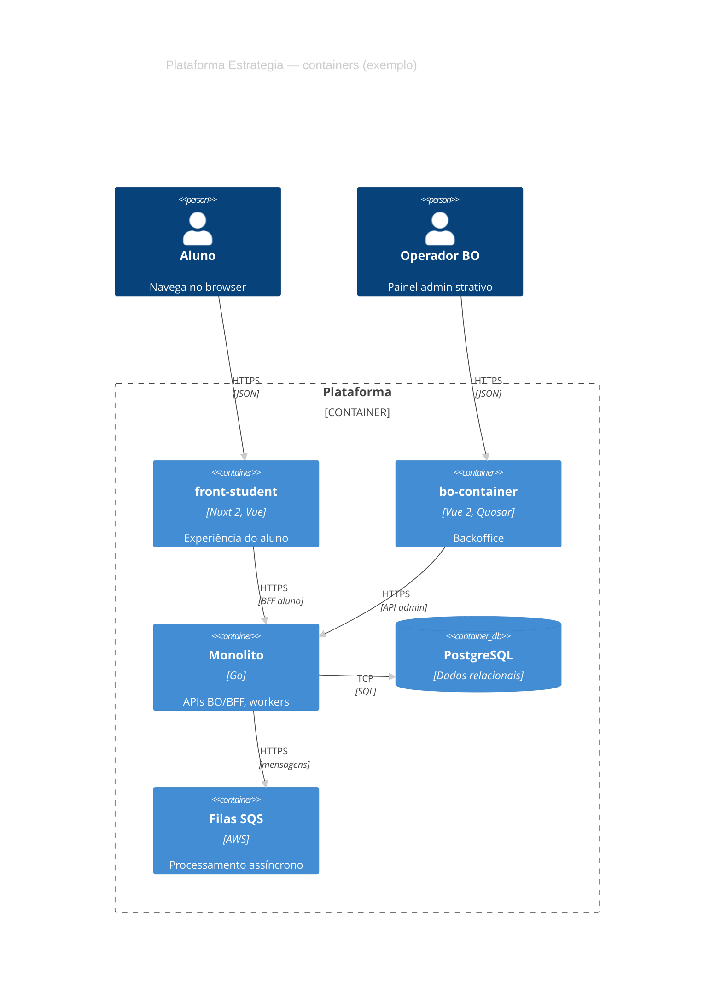

# Exemplo — C4 Container (referência)

## Para que serve neste contexto

| Uso | Papel |
|-----|--------|
| **Referência / cópia** | **Nível 2 C4**: **aplicações executáveis** (front-student, bo-container, monolito, DB, filas). |
| **Relay** | `diagram.mmd` + live. |

## Definição (resumo)

**C4Container** usa `Person`, `Container`, `ContainerDb`, `System_Ext`, `Rel`, `Container_Boundary`. Documentação: [C4 diagrams](https://mermaid.ai/open-source/syntax/c4.html).

## Diagrama de exemplo — Containers principais



## Colar no `base.html` / live

Interior do bloco → `diagram.mmd`.

## Pré-visualização pontual (opcional)

```bash
python3 /workspace/self/scripts/chrome-relay.py show /workspace/self/skills/webview/mermaid/template/c4-container.md
```

Ver `template/README.md`, `../styling-global.md`.
