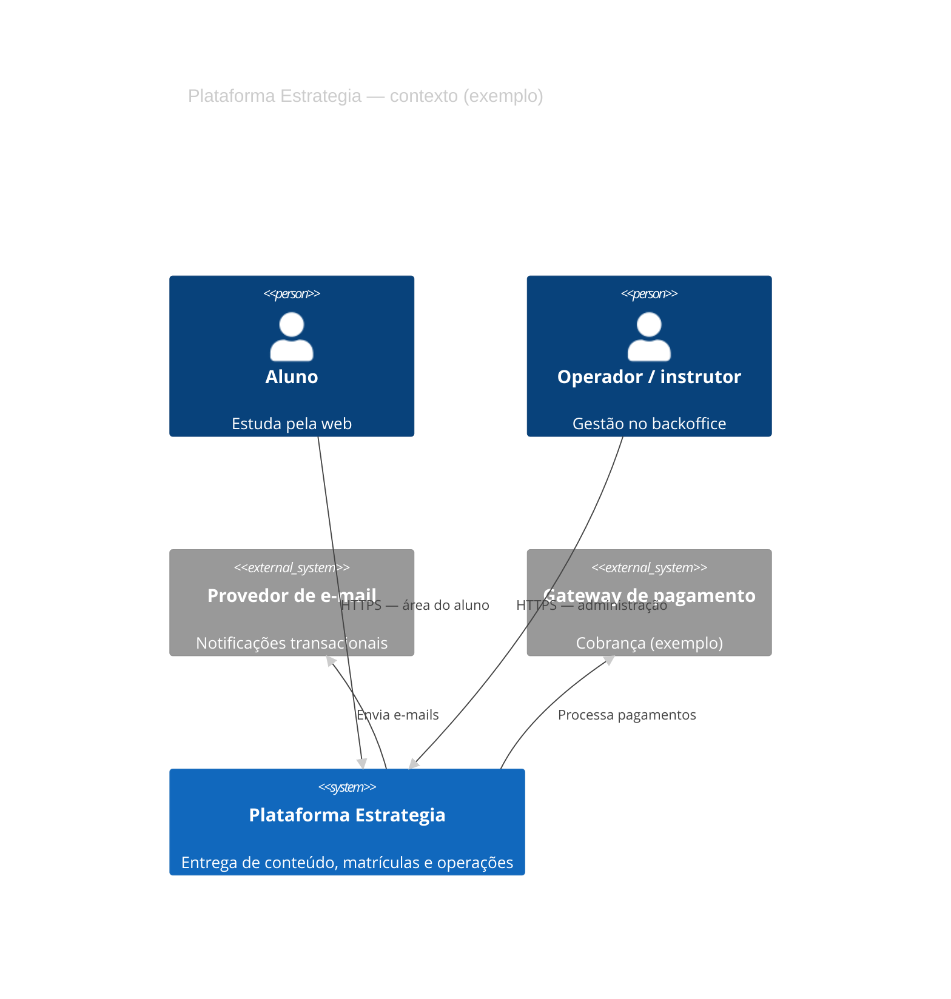

# Exemplo — C4 Context (referência)

## Para que serve neste contexto

| Uso | Papel |
|-----|--------|
| **Referência / cópia** | **Nível 1 C4**: atores humanos, sistema central e sistemas externos (sem detalhe de containers). |
| **Relay** | Ver `skills/webview/SKILL.md`. |

## Definição (resumo)

**C4Context** usa `Person`, `System`, `System_Ext`, `Rel`, etc. Documentação: [C4 diagrams](https://mermaid.ai/open-source/syntax/c4.html).

## Diagrama de exemplo — Plataforma Estrategia (contexto)



## Colar no `base.html` / live

Interior do bloco → `diagram.mmd`.

## Pré-visualização pontual (opcional)

```bash
python3 /workspace/self/scripts/chrome-relay.py show /workspace/self/skills/webview/mermaid/template/c4-context.md
```

Ver `template/README.md`, `../styling-global.md`.
