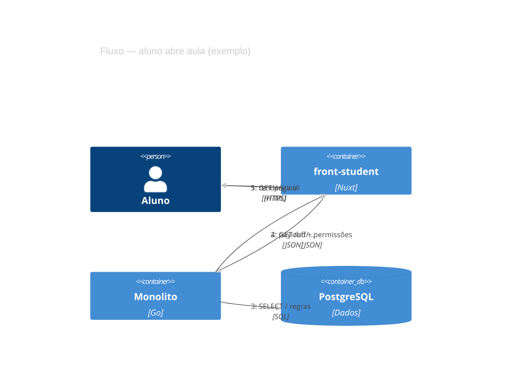

# Exemplo — C4 Dynamic (referência)

## Para que serve neste contexto

| Uso | Papel |
|-----|--------|
| **Referência / cópia** | **Fluxo dinâmico** em notação C4: quem chama quem (parecido a sequence, vista C4). |
| **Relay** | `diagram.mmd` + live. |

## Definição (resumo)

**C4Dynamic** combina elementos C4 com **Rel** encadeados para cenários temporais. Documentação: [C4 diagrams](https://mermaid.ai/open-source/syntax/c4.html).

## Diagrama de exemplo — Leitura de conteúdo pelo aluno



## Colar no `base.html` / live

Interior do bloco → `diagram.mmd`.

## Pré-visualização pontual (opcional)

```bash
python3 /workspace/self/scripts/chrome-relay.py show /workspace/self/skills/webview/mermaid/template/c4-dynamic.md
```

Ver `template/README.md`, `../styling-global.md`.
