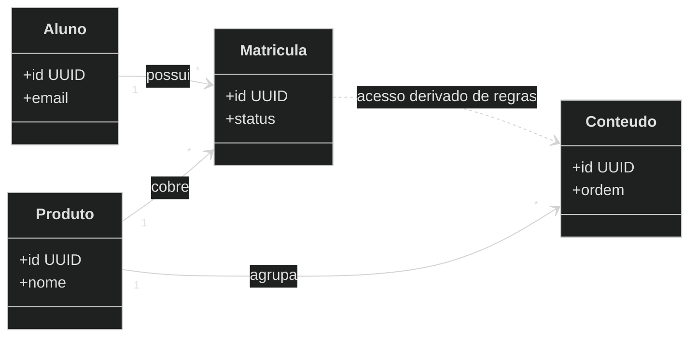

# Exemplo — Class diagram (referência)

## Para que serve neste contexto

| Uso | Papel |
|-----|--------|
| **Referência / cópia** | **Modelo de domínio** em UML: agregação, herança, multiplicidade (conceitual, não precisa coincidir 1:1 com código). |
| **Relay** | Ver `skills/webview/SKILL.md`. |

## Definição (resumo)

O **class diagram** representa **classes**, **interfaces**, **relacionamentos** e **métodos/campos** opcionais. Documentação: [Class diagram](https://mermaid.ai/open-source/syntax/classDiagram.html).

## Diagrama de exemplo — Domínio educacional (simplificado)



## Colar no `base.html` / live

Interior do bloco → `diagram.mmd`.

## Pré-visualização pontual (opcional)

```bash
python3 /workspace/self/scripts/chrome-relay.py show /workspace/self/skills/webview/mermaid/template/class.md
```

Ver `template/README.md`, `../styling-global.md`.
