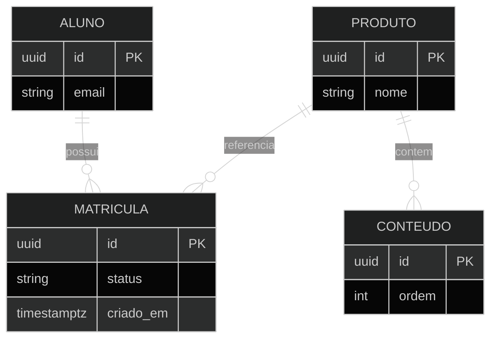

# Exemplo — ER diagram (referência)

## Para que serve neste contexto

| Uso | Papel |
|-----|--------|
| **Referência / cópia** | **Esquema relacional** e cardinalidade (tabelas/entidades principais). Complementa migrações e revisões de modelo. |
| **Relay** | `diagram.mmd` + live. |

## Definição (resumo)

O **ER diagram** em Mermaid descreve **entidades**, **atributos** e **relações** com cardinalidade. Documentação: [Entity Relationship](https://mermaid.ai/open-source/syntax/entityRelationshipDiagram.html).

## Diagrama de exemplo — Aluno, matrícula e produto



## Colar no `base.html` / live

Interior do bloco → `diagram.mmd`.

## Pré-visualização pontual (opcional)

```bash
python3 /workspace/self/scripts/chrome-relay.py show /workspace/self/skills/webview/mermaid/template/er.md
```

Ver `template/README.md`, `../styling-global.md`.
