# Template — Feature Diagram (mega blocos)

## Quando usar

Usuário pede qualquer um destes:
- "faça um diagrama da funcionalidade"
- "mapeie o diff da branch com a main"
- "mostre como os componentes se conectam"
- "arquitetura dessa feature"

Gerar **exatamente** este padrão. Adaptar nós/labels ao conteúdo real, manter estrutura e estilo.

---

## Estrutura obrigatória

```
flowchart LR
  FRONTEND (bo-container / front-student)
    └── pages/
        └── nó por arquivo .vue
    └── components/
        └── nó por componente relevante
        └── nó por modal de estado

  BACKEND (monolito)
    └── HTTP Handlers
        └── nó por endpoint (método + rota + in/out)
    └── services/
        └── nó por função pública (assinatura resumida)
    └── repositories/
        └── nó por query/método (com JOIN se relevante)
    └── JobTracking (se existir)

  ASYNC (worker + fila)
    └── SQS / fila
        └── nó producer + nó consumer
    └── worker
        └── nó por handler + DLQ
        └── nó do método principal executado
```

**Direção:** `flowchart LR` no topo (mega blocos lado a lado).
**Interno:** `direction TB` em todos os subgraphs (aninhamento vertical).

---

## Regras de estilo

### Cores por camada (Catppuccin-inspired)

| Camada | classDef | fill | stroke |
|--------|----------|------|--------|
| page Vue | `boPage` | `#1e3a5f` | `#89b4fa` (azul) |
| component Vue | `boComp` | `#2a1f4e` | `#cba6f7` (lilás) |
| HTTP handler | `handler` | `#0d4a2a` | `#a6e3a1` (verde) |
| service Go | `service` | `#3d3200` | `#f9e2af` (amarelo) |
| repository Go | `repo` | `#3d1a00` | `#fab387` (laranja) |
| JobTracking | `jt` | `#003a4d` | `#74c7ec` (ciano) |
| SQS | `sqs` | `#251a35` | `#cba6f7` (lilás) |
| worker | `worker` | `#3a1a1a` | `#f38ba8` (vermelho) |

### Cores dos mega blocos (via `style`)

```
style FRONT fill:#0d1f3a,stroke:#89b4fa,stroke-width:2px,color:#cdd6f4
style BACK  fill:#0a2010,stroke:#a6e3a1,stroke-width:3px,color:#cdd6f4
style ASYNC fill:#1a0d2e,stroke:#cba6f7,stroke-width:2px,color:#cdd6f4
```

### Emojis por tipo de nó

| Tipo | Emoji |
|------|-------|
| Página Vue | 📄 |
| Componente Vue | 🧩 |
| Modal | 🪟 |
| HTTP Handler (POST) | ➕ |
| HTTP Handler (PUT/PATCH) | 🔀 |
| HTTP Handler (publish) | 📢 |
| Service (check/validate) | 🔍 |
| Service (trigger/dispatch) | 🚀 |
| Service (goroutine) | ⚙️ |
| Service (resolver interno) | 🔎 |
| Service (build/compute) | 🌳 |
| Repository (novo) | 🆕 |
| Repository (list/get) | 📋 |
| Repository (join/relation) | 🔗 |
| JobTracking.Create | ➕ |
| JobTracking.Search | 🔍 |
| SQS producer | 📤 |
| SQS consumer | 📥 |
| Worker handler | ⚡ |
| Worker DLQ | 💀 |

### Labels das setas

- Conexão FE→BE: `"HTTP req"`
- Resposta 409: `"HTTP 409 { jobs[] }"`
- Verificação de conflito: `"① verifica conflito"`
- Disparo pós-operação: `"② dispara rebuild"`
- Goroutine: `"go"`
- Mensagem de fila: `"1 msg / <entidade>ID"`
- DLQ: `"falha → DLQ"`
- Path de resolução: `"via <campo>"` (ex: `"via CourseIDs"`)

---

## Template completo (copiar e adaptar)

```mermaid
%%{init: {'theme': 'base', 'themeVariables': {'primaryColor': '#313244', 'primaryTextColor': '#cdd6f4', 'primaryBorderColor': '#585b70', 'lineColor': '#6c7086', 'secondaryColor': '#1e1e2e', 'tertiaryColor': '#181825', 'background': '#1e1e2e', 'mainBkg': '#313244', 'nodeBorder': '#585b70', 'clusterBkg': '#181825', 'clusterBorder': '#45475a', 'titleColor': '#cdd6f4', 'edgeLabelBackground': '#1e1e2e', 'fontFamily': 'JetBrains Mono, monospace'}}}%%

flowchart LR

    subgraph FRONT["🖥️  FRONTEND — bo-container"]
        direction TB

        subgraph BO_PAGES["📂 pages/ldi/"]
            direction TB
            P1["📄 PageA\noperação X"]
            P2["📄 PageB\noperação Y"]
        end

        subgraph BO_COMP["🧩 components/"]
            direction TB
            C1["🧩 ComponentA\ndescrição"]
            M1["🪟 ModalEstado\nprops: isOpen, data[]\n@finished → re-executa\n@close → limpa estado"]
        end

        P1 -->|"renderiza"| C1
        P1 & P2 & C1 -->|"HTTP 409 { data[] }"| M1
    end

    subgraph BACK["⚙️  BACKEND — monolito"]
        direction TB

        subgraph MONO_H["🌐 HTTP Handlers"]
            direction TB
            H1["➕ handler_a.go\nPOST /resource/:id/sub\nin: id, payload\nout: 201 | 409+data"]
            H2["🔀 handler_b.go\nPUT /resource/:id\nin: id, body\nout: 200 | 409+data"]
        end

        subgraph MONO_SVC["🔧 services/domain/"]
            direction TB
            S1["🔍 CheckConflict\nin: ctx, Opts\nout: nil | ErrConflict{Data}"]
            S2["🔎 resolveIDs\n• FieldA → direto\n• FieldB → GetByX\nout: []id"]
            S3["🚀 TriggerAction\nin: ctx, Opts → goroutine\nout: void (async)"]
            S4["⚙️ doAction (goroutine)\n① resolveIDs\n② GetRelatedIDs\n③ JobTracking.Create\n④ Queue.Send × id"]
            S1 --> S2
            S3 -->|"go"| S4
            S4 --> S2
        end

        subgraph MONO_REPO["🗄️  repositories/domain/"]
            direction TB
            R1["🆕 GetRelatedIDsByIDs\nJOIN: table_a → table_b\n→ table_c → table_d\nout: []relatedID DISTINCT"]
            R2["📋 GetIDsByRelatedIDs\nin: []relatedID → out: []id"]
        end

        subgraph JT["📊 JobTracking"]
            direction TB
            JT_C["➕ JobTracking.Create\ntype: DOMAIN_ACTION\nRelatedIDs: []id\nout: Job{ID}"]
            JT_S["🔍 JobTracking.Search\nstatus: running\nrelatedIDs: []id\nout: []Job"]
        end

        H1 & H2 -->|"① verifica conflito"| S1
        S1 -->|"409 + Data[]"| H1 & H2
        H1 & H2 -->|"② dispara ação"| S3

        S2 -->|"via FieldB"| R2
        R2 -->|"[]id"| S2

        S4 -->|"[]id"| R1
        R1 -->|"[]relatedID"| S4

        S1 -->|"busca ativos"| JT_S
        JT_S -->|"[]Job"| S1
        S4 -->|"cria job"| JT_C
        JT_C -->|"job.ID"| S4
    end

    subgraph ASYNC["📬  ASYNC — fila + worker"]
        direction TB

        subgraph QUEUE["📬 Fila — DOMAIN.ActionName"]
            direction TB
            Q_S["📤 Queue.Send\npayload: { entity_id, job_id }"]
            Q_R["📥 Consumer\nDOMAIN.ActionHandlerName"]
            Q_S -->|"enfileira"| Q_R
        end

        subgraph WORKER["👷  worker — handlers/domain/worker.go"]
            direction TB
            W1["⚡ HandleAction\nin: ctx, Message\n→ unmarshal payload\n→ Service.Execute\nout: error"]
            W2["🌳 Execute\nin: ctx, entityID\n→ processa e persiste\nout: result, error"]
            W3["💀 HandleActionDLQ\n→ registra falha\nout: nil"]
            W1 -->|"entityID"| W2
        end

        Q_R --> W1
        Q_R -->|"falha → DLQ"| W3
    end

    %% conexões entre mega blocos
    P1 -->|"HTTP req"| H1
    P2 -->|"HTTP req"| H2
    S4 -->|"1 msg / entityID"| Q_S

    %% mega bloco backgrounds
    style FRONT fill:#0d1f3a,stroke:#89b4fa,stroke-width:2px,color:#cdd6f4
    style BACK  fill:#0a2010,stroke:#a6e3a1,stroke-width:3px,color:#cdd6f4
    style ASYNC fill:#1a0d2e,stroke:#cba6f7,stroke-width:2px,color:#cdd6f4

    %% classDefs
    classDef boPage   fill:#1e3a5f,stroke:#89b4fa,color:#cdd6f4
    classDef boComp   fill:#2a1f4e,stroke:#cba6f7,color:#cdd6f4
    classDef handler  fill:#0d4a2a,stroke:#a6e3a1,color:#cdd6f4
    classDef service  fill:#3d3200,stroke:#f9e2af,color:#cdd6f4
    classDef repo     fill:#3d1a00,stroke:#fab387,color:#cdd6f4
    classDef jt       fill:#003a4d,stroke:#74c7ec,color:#cdd6f4
    classDef sqs      fill:#251a35,stroke:#cba6f7,color:#cdd6f4
    classDef worker   fill:#3a1a1a,stroke:#f38ba8,color:#cdd6f4

    class P1,P2 boPage
    class C1,M1 boComp
    class H1,H2 handler
    class S1,S2,S3,S4 service
    class R1,R2 repo
    class JT_C,JT_S jt
    class Q_S,Q_R sqs
    class W1,W2,W3 worker
```



---

## Como gerar a partir de um diff

1. `git diff main...HEAD --stat` → lista de arquivos alterados
2. `git diff main...HEAD -- <arquivo>` → ver mudanças por arquivo relevante
3. Ler os arquivos modificados para entender assinaturas, novos métodos, structs
4. Montar o diagrama com:
   - **FE** → arquivos `.vue` modificados
   - **BACK handlers** → arquivos em `handlers/` modificados
   - **BACK services** → funções novas/alteradas em `services/`
   - **BACK repos** → métodos novos em `repositories/`
   - **ASYNC** → se houver SQS, worker, fila
5. Aplicar `classDef` e `style` conforme tabela acima
6. Subir no relay: `mermaid_live_server.py` + `mermaid-push` + `relay-nav`

## Exemplo real

Ver: `projects/coruja/tarefas/FUK2-11748-toc-builder.md`
