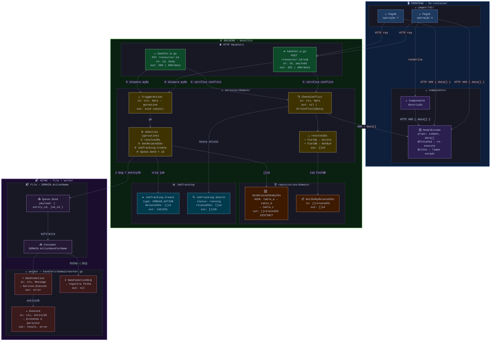

# Template — Feature Diagram (mega blocos)

## Quando usar

Usuário pede qualquer um destes:
- "faça um diagrama da funcionalidade"
- "mapeie o diff da branch com a main"
- "mostre como os componentes se conectam"
- "arquitetura dessa feature"

Gerar **exatamente** este padrão. Adaptar nós/labels ao conteúdo real, manter estrutura e estilo.

---

## Estrutura obrigatória

```
flowchart TD                          ← mega blocos empilham TD

  FRONTEND (direction LR)             ← pages e components lado a lado
    └── pages/ (direction TB)
        └── nó por arquivo .vue
    └── components/ (direction TB)
        └── nó por componente relevante
        └── nó por modal de estado

  BACKEND (direction LR)              ← camadas lado a lado horizontalmente
    └── HTTP Handlers (direction TB)  ← nós empilham dentro da caixa
    └── services/ (direction TB)
    └── repositories/ (direction TB)
    └── JobTracking (direction TB)    ← se existir

  ASYNC (direction LR)                ← fila e worker lado a lado
    └── SQS/fila (direction TB)
    └── worker (direction TB)
```

**Regra crítica de layout:**
- `flowchart TD` no topo — mega blocos um abaixo do outro
- Mega blocos FRONT e ASYNC: `direction LR` (sub-caixas lado a lado)
- Mega bloco BACK: `direction LR` — as 4 camadas ficam lado a lado horizontalmente
- Dentro de cada camada: `direction TB` — nós empilham verticalmente
- **Nunca** conectar subgraph→subgraph (`MONO_H --> MONO_SVC`) — isso quebra o layout. Só conexões nó→nó.

---

## Regras de estilo

### Cores dos mega blocos (via `style`)

```
style FRONT fill:#0d1f3a,stroke:#89b4fa,stroke-width:2px,color:#cdd6f4
style BACK  fill:#0a2010,stroke:#a6e3a1,stroke-width:3px,color:#cdd6f4
style ASYNC fill:#1a0d2e,stroke:#cba6f7,stroke-width:2px,color:#cdd6f4
```

### Cores por camada (classDef)

| Camada | classDef | fill | stroke |
|--------|----------|------|--------|
| page Vue | `boPage` | `#1e3a5f` | `#89b4fa` azul |
| component/modal Vue | `boComp` | `#2a1f4e` | `#cba6f7` lilás |
| HTTP handler | `handler` | `#0d4a2a` | `#a6e3a1` verde |
| service Go | `service` | `#3d3200` | `#f9e2af` amarelo |
| repository Go | `repo` | `#3d1a00` | `#fab387` laranja |
| JobTracking | `jt` | `#003a4d` | `#74c7ec` ciano |
| SQS/fila | `sqs` | `#251a35` | `#cba6f7` lilás |
| worker | `worker` | `#3a1a1a` | `#f38ba8` vermelho |

### Emojis por tipo de nó

| Tipo | Emoji |
|------|-------|
| Página Vue | 📄 |
| Componente Vue | 🧩 |
| Modal de estado | 🪟 |
| HTTP Handler POST | ➕ |
| HTTP Handler PUT/PATCH | 🔀 |
| HTTP Handler publish | 📢 |
| Service check/validate | 🔍 |
| Service trigger/dispatch | 🚀 |
| Service goroutine | ⚙️ |
| Service resolver interno | 🔎 |
| Service build/compute | 🌳 |
| Repository novo | 🆕 |
| Repository list/get | 📋 |
| Repository join/relation | 🔗 |
| JobTracking Create | ➕ |
| JobTracking Search | 🔍 |
| SQS producer | 📤 |
| SQS consumer | 📥 |
| Worker handler | ⚡ |
| Worker DLQ | 💀 |

### Labels padrão das setas

| Seta | Label |
|------|-------|
| FE → BE | `"HTTP req"` |
| BE → FE (erro) | `"409 + Jobs[]"` |
| Handler → service (check) | `"① verifica conflito"` |
| Handler → service (trigger) | `"② dispara rebuild"` |
| Goroutine | `"go"` |
| BACK → ASYNC | `"1 msg / <entidade>ID"` |
| Consumer → DLQ | `"falha → DLQ"` |
| Resolve path | `"via <campo>"` |

---

## Template completo (copiar e adaptar)



---

## Como gerar a partir de um diff

1. `git diff main...HEAD --stat` → lista arquivos alterados
2. `git diff main...HEAD -- <arquivo>` → mudanças por arquivo
3. Ler arquivos modificados para mapear assinaturas, novos métodos, structs
4. Montar:
   - **FRONT** → arquivos `.vue` em pages/ e components/
   - **BACK Handlers** → arquivos em `handlers/` com rota + in/out
   - **BACK Services** → funções novas/alteradas com assinatura resumida
   - **BACK Repos** → métodos novos com JOINs se relevante
   - **ASYNC** → se houver SQS, worker, fila
5. Aplicar `classDef` e `style` da tabela acima
6. **Nunca** conectar subgraph→subgraph — só nó→nó
7. Subir no relay: `mermaid_live_server.py` + `mermaid-push` + `relay-nav`

## Exemplo real

Ver: `projects/coruja/tarefas/FUK2-11748-toc-builder.md`
