# Exemplo — Flowchart com `subgraph` (vários fluxos ligados)

## Para que serve neste contexto

| Uso | Papel |
|-----|--------|
| **Referência / cópia** | **Segregar** partes do sistema (repos, apps, filas) em **caixas** distintas e **ligar** com setas — um único `flowchart`, vários blocos. |
| **Relay** | Copiar o bloco `mermaid` para **`diagram.mmd`** ou fluxo live — ver `skills/webview/SKILL.md`. |

## Regras rápidas

- Um ficheiro Mermaid = **um** grafo: usa **`subgraph id["título"] ... end`** por “fatia” (ex.: `front-student`, `bo-container`, monolito, SQS).
- **`direction TB` / `LR`** *dentro* do `subgraph` controla o fluxo interno; o **`flowchart TB|LR`** no topo posiciona os blocos uns relativamente aos outros.
- **Arestas entre blocos**: liga **ids de nós** de subgraphs diferentes (`f4 --> m1`), com rótulo opcional `-->|texto|`.
- **Estilo por bloco**: `style ID_DO_SUBGRAPH fill:...,stroke:...` (o id é o primeiro token após `subgraph`, ex.: `FS`, `BO`).
- Ver também `../styling-global.md` — secção **Subgrafos (vários fluxos)**.

## Diagrama de exemplo — quatro fronteiras (aluno, BO, API, assíncrono)

```mermaid
%%{init: {'theme': 'dark'}}%%
flowchart LR
  subgraph FS["front-student — aluno"]
    direction TB
    f1([Página Nuxt]) --> f2[axios BFF]
    f2 --> f3{rota protegida?}
    f3 -->|sim| f4[GET /bff/...]
  end

  subgraph BO["bo-container — operador"]
    direction TB
    b1[Quasar UI] --> b2[PATCH /bo/...]
  end

  subgraph API["Monolito — API"]
    direction TB
    m1[Handlers] --> m2[Services]
    m2 --> m3[(PostgreSQL)]
  end

  subgraph Q["Assíncrono — fila"]
    direction TB
    q1[[SQS]] --> q2[Worker]
    q2 --> q3[(projeções)]
  end

  f4 -->|"JWT"| m1
  b2 -->|"JWT + JSON"| m1
  m2 -->|"evento"| q1
  q2 -.->|"opcional"| m2

  style FS fill:#1e1e2e,stroke:#f5c2e7,stroke-width:2px
  style BO fill:#1e1e2e,stroke:#89b4fa,stroke-width:2px
  style API fill:#1e1e2e,stroke:#a6e3a1,stroke-width:2px
  style Q fill:#1e1e2e,stroke:#fab387,stroke-width:2px,color:#e4e4e7
```



## Colar no `base.html` / live

Interior do bloco → `diagram.mmd` (sem cercas ` ```mermaid `).

## Pré-visualização pontual (opcional)

```bash
python3 /workspace/self/scripts/chrome-relay.py show /workspace/self/skills/webview/mermaid/template/flow-subgraphs.md
```

Ver `template/README.md` e `../styling-global.md`.
