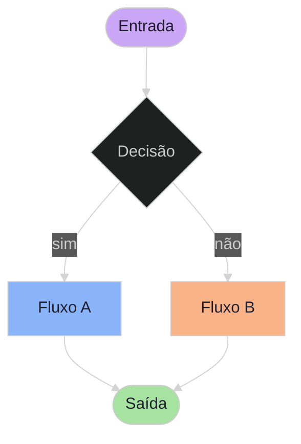

# Exemplo — Flowchart (referência)

**Índice de todos os tipos:** `template/README.md` · **Tema / cores / estilos globais:** `../styling-global.md`.  
**Vários fluxos na mesma figura (apps ligados):** `template/flow-subgraphs.md`.

## Para que serve neste contexto

| Uso | Papel |
|-----|--------|
| **Referência / cópia** | O bloco `mermaid` abaixo é um **modelo** de sintaxe (tema dark, nós estilizados). Copias o interior do bloco para **`diagram.mmd`** ou para **`MERMAID_DIAGRAM_HERE`** em `mermaid/base.html` quando geres HTML a partir do template. |
| **Não é o fluxo oficial** para “mostrar ao utilizador no vennon” | O caminho **obrigatório** continua a ser **relay live**: `mermaid_live_server.py` + `base.html` + `diagram.mmd` + `relay-nav` (ver `skills/webview/SKILL.md`, **Política obrigatória**). |
| **Exceção legada** | Podes guardar este ficheiro e correr `chrome-relay.py show …/flow.md` só para **pré-visualização rápida** de um `.md` — **não** substitui o holodeck live. |

Resumo: **`flow.md` = caixa de exemplos / snippet**, não a “app” Mermaid. A ferramenta que construímos é o par **`base.html` + servidor live**.

---

## Diagrama de exemplo (Catppuccin)



## Colar no `base.html`

Substitui **`MERMAID_DIAGRAM_HERE`** pelo conteúdo do diagrama **sem** cercas ` ```mermaid ` (só o texto que está dentro do bloco acima).

## Colar no fluxo live

1. Copia o mesmo texto para **`diagram.mmd`** (na pasta servida pelo `mermaid_live_server.py`).
2. `POST /mermaid-push` ou grava o ficheiro e deixa o watcher atualizar.

## Pré-visualização pontual (opcional, legado)

```bash
python3 /workspace/self/scripts/chrome-relay.py show /workspace/self/skills/webview/mermaid/template/flow.md
```

Isto usa o renderer Markdown do relay, **não** o holodeck com SSE e indicador LIVE.
