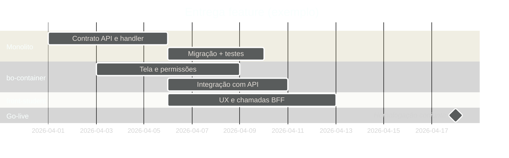

# Exemplo — Gantt (referência)

## Para que serve neste contexto

| Uso | Papel |
|-----|--------|
| **Referência / cópia** | **Cronograma** de entregas: monolito, BO, front-student, milestones e dependências. |
| **Relay** | `diagram.mmd` + live. |

## Definição (resumo)

O diagrama **Gantt** mostra **tarefas**, **datas** e **dependências** ao longo de um eixo temporal. Documentação: [Gantt](https://mermaid.ai/open-source/syntax/gantt.html).

## Diagrama de exemplo — Release com API + BO + aluno



## Colar no `base.html` / live

Interior do bloco → `diagram.mmd`.

## Pré-visualização pontual (opcional)

```bash
python3 /workspace/self/scripts/chrome-relay.py show /workspace/self/skills/webview/mermaid/template/gantt.md
```

Ver `template/README.md`, `../styling-global.md`.
