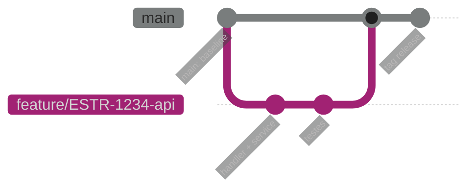

# Exemplo — Git graph (referência)

## Para que serve neste contexto

| Uso | Papel |
|-----|--------|
| **Referência / cópia** | **Histórico Git** simplificado: feature branch, merge no main, hotfix. |
| **Relay** | `diagram.mmd` + live. |

## Definição (resumo)

O **gitGraph** descreve **commits**, **branches**, **checkouts** e **merges** em notação declarativa. Documentação: [Git graph](https://mermaid.ai/open-source/syntax/gitgraph.html).

## Diagrama de exemplo — Feature no monolito



## Colar no `base.html` / live

Interior do bloco → `diagram.mmd`.

## Pré-visualização pontual (opcional)

```bash
python3 /workspace/self/scripts/chrome-relay.py show /workspace/self/skills/webview/mermaid/template/gitgraph.md
```

Ver `template/README.md`, `../styling-global.md`.
