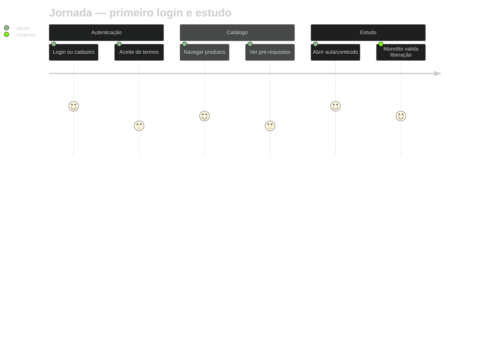

# Exemplo — User journey (referência)

## Para que serve neste contexto

| Uso | Papel |
|-----|--------|
| **Referência / cópia** | **Jornada** do aluno ou do operador: etapas + **nível de satisfação** (1–5). Bom para UX e onboarding. |
| **Relay** | Ver `skills/webview/SKILL.md`. |

## Definição (resumo)

O **journey** diagram lista **seções**, **tarefas** e **scores** numéricos por etapa. Documentação: [User journey](https://mermaid.ai/open-source/syntax/userJourney.html).

## Diagrama de exemplo — Primeiro acesso do aluno (front-student)



## Colar no `base.html` / live

Interior do bloco → `diagram.mmd`.

## Pré-visualização pontual (opcional)

```bash
python3 /workspace/self/scripts/chrome-relay.py show /workspace/self/skills/webview/mermaid/template/journey.md
```

Ver `template/README.md`, `../styling-global.md`.
