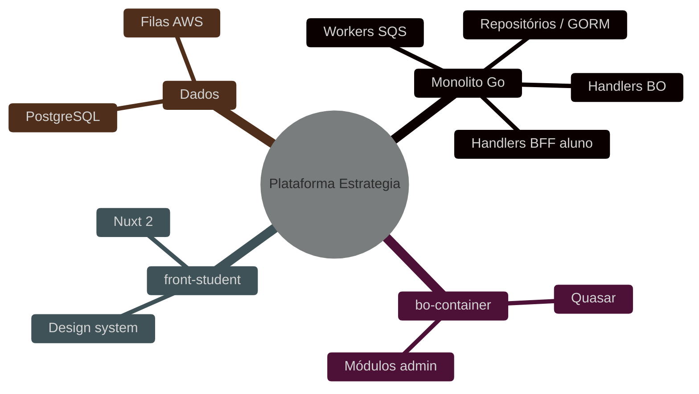

# Exemplo — Mindmap (referência)

## Para que serve neste contexto

| Uso | Papel |
|-----|--------|
| **Referência / cópia** | **Hierarquia radial**: ecossistema, módulos do monolito, áreas do BO ou do aluno. |
| **Relay** | Ver `skills/webview/SKILL.md`. |

## Definição (resumo)

O **mindmap** organiza ideias a partir de um **nó raiz** com ramos aninhados. Documentação: [Mindmap](https://mermaid.ai/open-source/syntax/mindmap.html).

## Diagrama de exemplo — Plataforma Estrategia (visão macro)



## Colar no `base.html` / live

Interior do bloco → `diagram.mmd`.

## Pré-visualização pontual (opcional)

```bash
python3 /workspace/self/scripts/chrome-relay.py show /workspace/self/skills/webview/mermaid/template/mindmap.md
```

Ver `template/README.md`, `../styling-global.md`.
