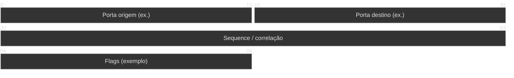

# Exemplo — Packet diagram (referência)

## Para que serve neste contexto

| Uso | Papel |
|-----|--------|
| **Referência / cópia** | **Estrutura de bits** de cabeçalhos (TCP, frame interno, layout de mensagem binária). Requer Mermaid **v11+** (`+N` para largura em bits desde v11.7). |
| **Relay** | Ver `skills/webview/SKILL.md`. |

## Definição (resumo)

O diagrama **packet** declara **campos** com intervalos de bits ou `+bits`. Documentação: [Packet](https://mermaid.ai/open-source/syntax/packet.html).

## Diagrama de exemplo — Cabeçalho simplificado (ilustrativo)



## Colar no `base.html` / live

Interior do bloco → `diagram.mmd`.

## Pré-visualização pontual (opcional)

```bash
python3 /workspace/self/scripts/chrome-relay.py show /workspace/self/skills/webview/mermaid/template/packet.md
```

Ver `template/README.md`, `../styling-global.md`.
