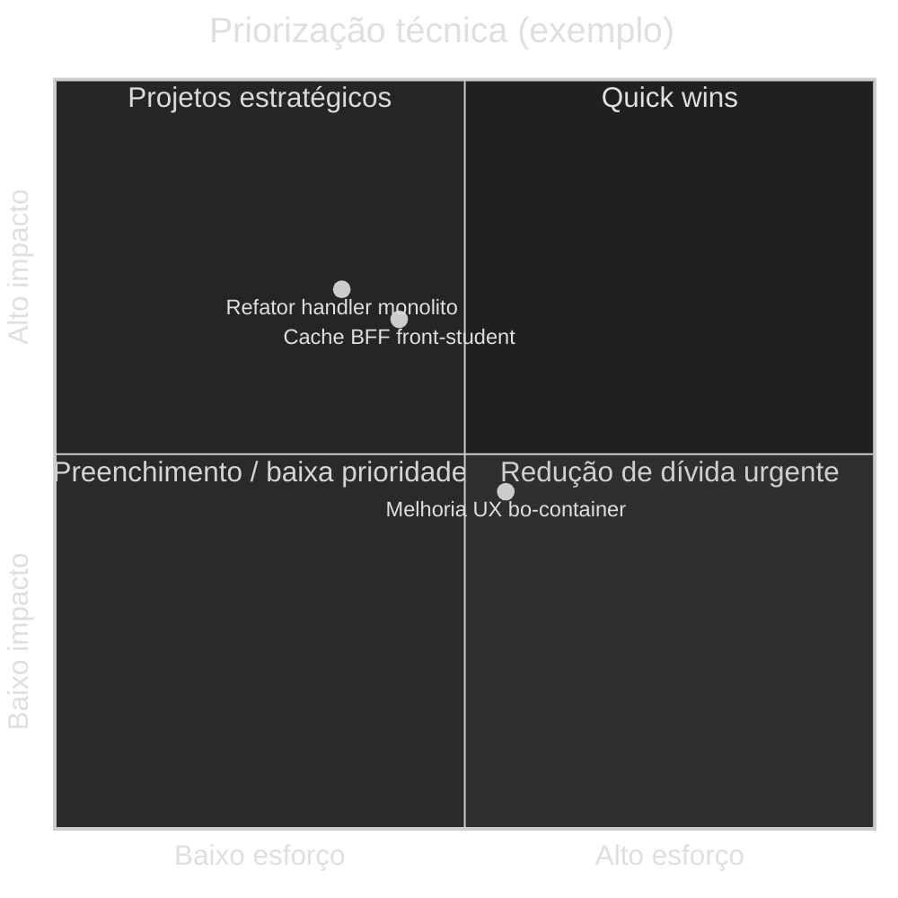

# Exemplo — Quadrant chart (referência)

## Para que serve neste contexto

| Uso | Papel |
|-----|--------|
| **Referência / cópia** | **Priorização** em duas dimensões: esforço/impacto, risco/valor, urgência/importância. |
| **Relay** | Ver `skills/webview/SKILL.md`. |

## Definição (resumo)

O **quadrantChart** define **eixos**, **quadrantes** nomeados e **pontos** com coordenadas. Documentação: [Quadrant Chart](https://mermaid.ai/open-source/syntax/quadrantChart.html).

## Diagrama de exemplo — Backlog técnico (ilustrativo)



## Colar no `base.html` / live

Interior do bloco → `diagram.mmd`.

## Pré-visualização pontual (opcional)

```bash
python3 /workspace/self/scripts/chrome-relay.py show /workspace/self/skills/webview/mermaid/template/quadrant.md
```

Ver `template/README.md`, `../styling-global.md`.
