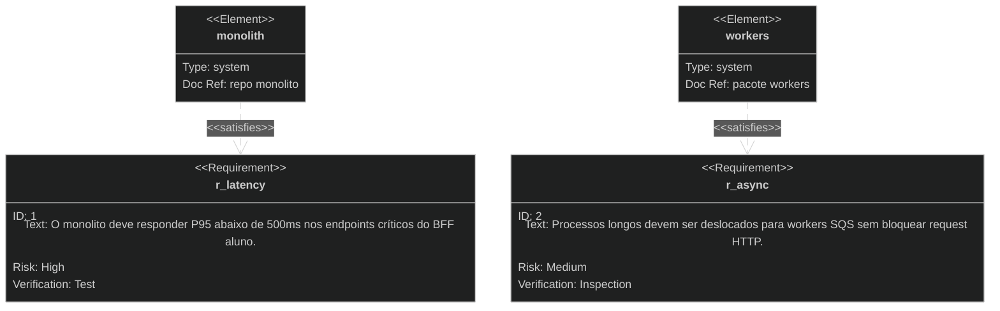

# Exemplo — Requirement diagram (referência)

## Para que serve neste contexto

| Uso | Papel |
|-----|--------|
| **Referência / cópia** | **Requisitos** (funcionais/NFR) ligados a **elementos** do sistema (caixa preta). |
| **Relay** | `diagram.mmd` + live. |

## Definição (resumo)

O **requirement diagram** liga **requisitos** a **elementos** com relações como *satisfies*, *verifies*. Documentação: [Requirement diagram](https://mermaid.ai/open-source/syntax/requirementDiagram.html).

## Diagrama de exemplo — NFR sobre API e filas



## Colar no `base.html` / live

Interior do bloco → `diagram.mmd`.

## Pré-visualização pontual (opcional)

```bash
python3 /workspace/self/scripts/chrome-relay.py show /workspace/self/skills/webview/mermaid/template/requirement.md
```

Ver `template/README.md`, `../styling-global.md`.
