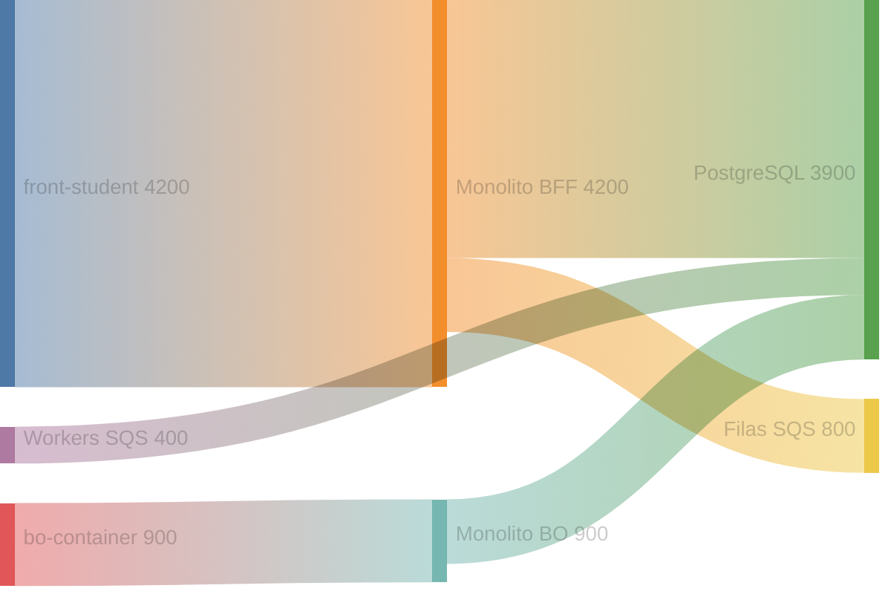

# Exemplo — Sankey (referência)

## Para que serve neste contexto

| Uso | Papel |
|-----|--------|
| **Referência / cópia** | **Fluxo de volume** entre nós (requests, eventos, utilizadores) — ver proporções entre camadas. |
| **Relay** | Ver `skills/webview/SKILL.md`. |

## Definição (resumo)

O diagrama **sankey** liga **origem → destino** com **peso** numérico (CSV de 3 colunas). Documentação: [Sankey](https://mermaid.ai/open-source/syntax/sankey.html). Em versões recentes o tipo pode aparecer como `sankey` ou `sankey-beta` conforme o bundle.

## Diagrama de exemplo — Tráfego agregado (ilustrativo)

Nomes com espaços ou vírgulas: usar **aspas duplas** (RFC CSV).



## Colar no `base.html` / live

Interior do bloco → `diagram.mmd`.

## Pré-visualização pontual (opcional)

```bash
python3 /workspace/self/scripts/chrome-relay.py show /workspace/self/skills/webview/mermaid/template/sankey.md
```

Ver `template/README.md`, `../styling-global.md`.
