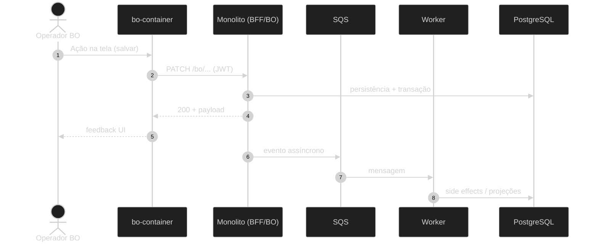

# Exemplo — Sequence diagram (referência)

## Para que serve neste contexto

| Uso | Papel |
|-----|--------|
| **Referência / cópia** | Modelo de **mensagens** entre atores ao longo do tempo (HTTP, fila, DB). Ideal para explicar um fluxo ponta a ponta (ex.: BO → monolito → SQS). |
| **Relay** | Copiar o bloco `mermaid` para **`diagram.mmd`** ou fluxo live — ver `skills/webview/SKILL.md`. |

## Definição (resumo)

O **sequence diagram** mostra **interações ordenadas** entre participantes (lifelines), com mensagens síncronas/assíncronas, ativações e notas. Documentação: [Sequence diagram](https://mermaid.ai/open-source/syntax/sequenceDiagram.html).

## Diagrama de exemplo — Publicar conteúdo no BO (simplificado)



## Colar no `base.html` / live

Substituir **`MERMAID_DIAGRAM_HERE`** ou gravar em **`diagram.mmd`** (sem cercas ` ```mermaid `).

## Pré-visualização pontual (opcional)

```bash
python3 /workspace/self/scripts/chrome-relay.py show /workspace/self/skills/webview/mermaid/template/sequence.md
```

Ver também `template/README.md` e `../styling-global.md`.
