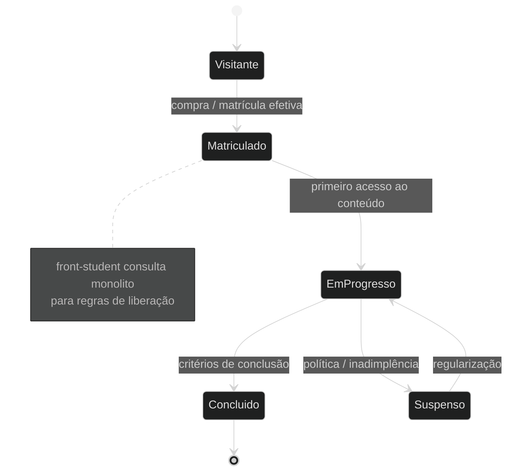

# Exemplo — State diagram (referência)

## Para que serve neste contexto

| Uso | Papel |
|-----|--------|
| **Referência / cópia** | **Máquinas de estado**: matrícula, pedido, job assíncrono, feature com estados claros. |
| **Relay** | `diagram.mmd` + live — ver `skills/webview/SKILL.md`. |

## Definição (resumo)

O **state diagram** modela **estados**, **transições**, eventuais **estados compostos** e histórico. Documentação: [State diagram](https://mermaid.ai/open-source/syntax/stateDiagram.html).

## Diagrama de exemplo — Acesso do aluno a um produto/conteúdo



## Colar no `base.html` / live

Conteúdo interno do bloco `mermaid` → `diagram.mmd` ou placeholder no HTML.

## Pré-visualização pontual (opcional)

```bash
python3 /workspace/self/scripts/chrome-relay.py show /workspace/self/skills/webview/mermaid/template/state.md
```

Ver `template/README.md`, `../styling-global.md`.
