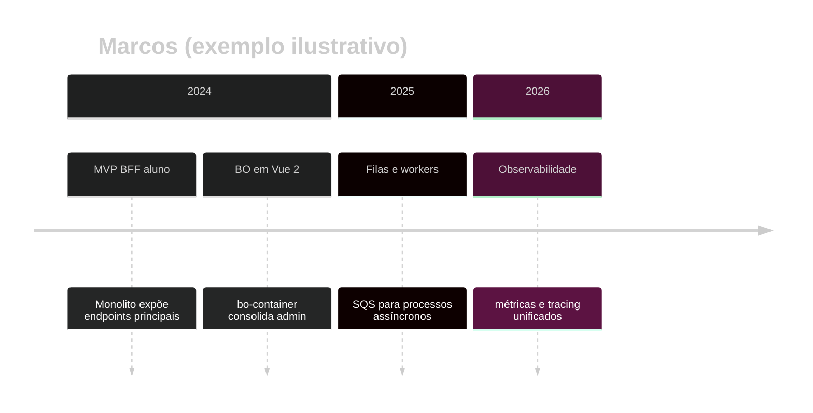

# Exemplo — Timeline (referência)

## Para que serve neste contexto

| Uso | Papel |
|-----|--------|
| **Referência / cópia** | **Linha do tempo** de produto ou tecnologia: marcos, releases, migrações. |
| **Relay** | `diagram.mmd` + live. |

## Definição (resumo)

O **timeline** agrupa eventos por **período** (seção) com entradas textuais. Documentação: [Timeline](https://mermaid.ai/open-source/syntax/timeline.html).

## Diagrama de exemplo — Evolução da stack (ilustrativo)



## Colar no `base.html` / live

Interior do bloco → `diagram.mmd`.

## Pré-visualização pontual (opcional)

```bash
python3 /workspace/self/scripts/chrome-relay.py show /workspace/self/skills/webview/mermaid/template/timeline.md
```

Ver `template/README.md`, `../styling-global.md`.
