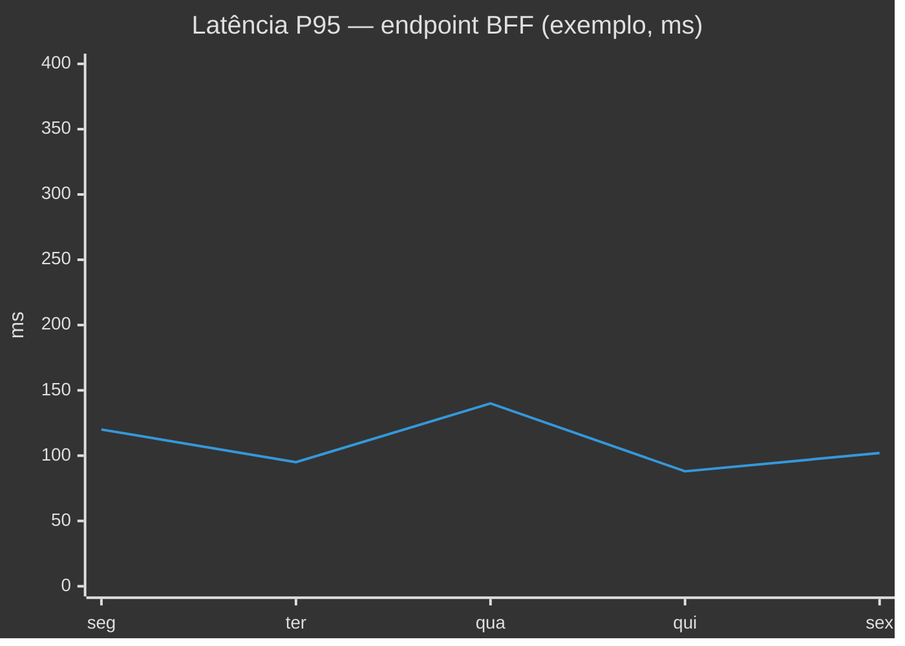

# Exemplo — XY chart (referência)

## Para que serve neste contexto

| Uso | Papel |
|-----|--------|
| **Referência / cópia** | **Séries** em barras ou linhas: latência, throughput, erros por dia. |
| **Relay** | `diagram.mmd` + live. |

## Definição (resumo)

O **xychart-beta** define **título**, **eixo X** (categorias), **eixo Y** (intervalo numérico) e **séries** (`bar` / `line`). Documentação: [XY Chart](https://mermaid.ai/open-source/syntax/xyChart.html).

## Diagrama de exemplo — Latência P95 por dia (ilustrativa)



## Colar no `base.html` / live

Interior do bloco → `diagram.mmd`.

## Pré-visualização pontual (opcional)

```bash
python3 /workspace/self/scripts/chrome-relay.py show /workspace/self/skills/webview/mermaid/template/xychart.md
```

Ver `template/README.md`, `../styling-global.md`.
