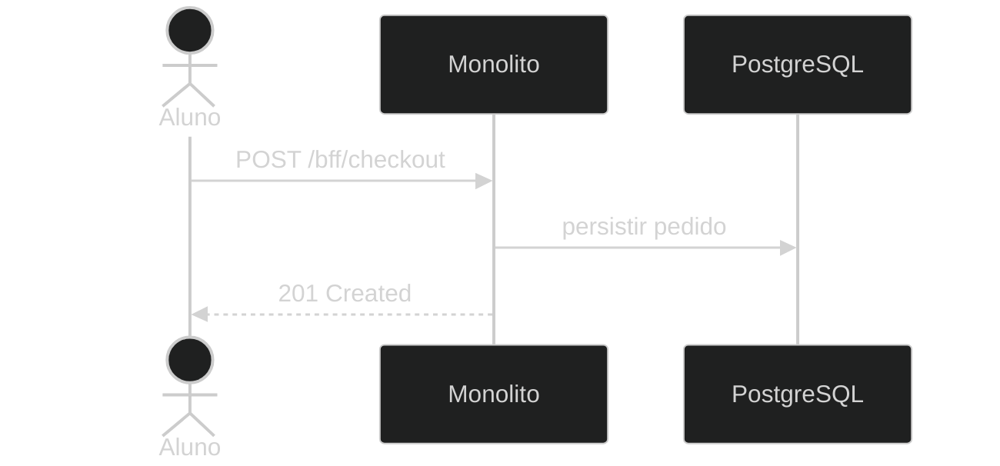

# Exemplo — ZenUML (plugin)

## Para que serve neste contexto

| Uso | Papel |
|-----|--------|
| **Referência** | Sintaxe **ZenUML** para diagramas de sequência mais compactos; depende de **plugin** no bundle Mermaid. |
| **Relay padrão** | O `base.html` oficial usa `mermaid.min.js` **sem** garantir o plugin ZenUML — se não renderizar, usar **`sequenceDiagram`** nativo (`template/sequence.md`). |

## Definição (resumo)

ZenUML é um **dialeto** de sequência; no bundle do `base.html` **não** vem garantido. Documentação geral: [Mermaid syntax](https://mermaid.ai/open-source/syntax/syntax.html).

Sintaxe típica ZenUML (referência textual — **não** colar como Mermaid se o plugin não estiver ativo):

```text
@Actor Aluno
@Database DB
Aluno -> Monolito: POST /bff/checkout
Monolito -> DB: persistir pedido
```

## Exemplo que renderiza no relay — sequenceDiagram nativo

Use **`template/sequence.md`** para histórias completas. Abaixo, o mesmo tipo de mensagem em **Mermaid nativo** (sempre válido):



## Colar no `base.html` / live

Para ZenUML real: só após registar o plugin na inicialização do Mermaid (fora do escopo do `base.html` padrão). No dia a dia, preferir o bloco `sequenceDiagram` acima ou `sequence.md`.

## Pré-visualização pontual (opcional)

```bash
python3 /workspace/self/scripts/chrome-relay.py show /workspace/self/skills/webview/mermaid/template/zenuml.md
```

Ver `template/README.md`, `../styling-global.md`.
