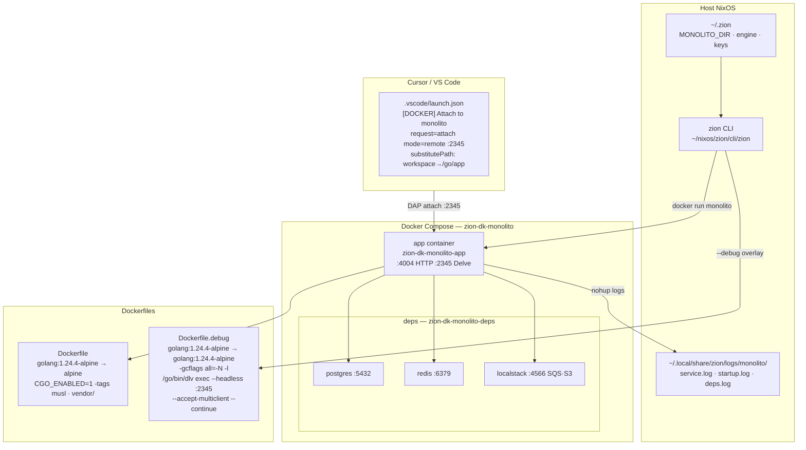
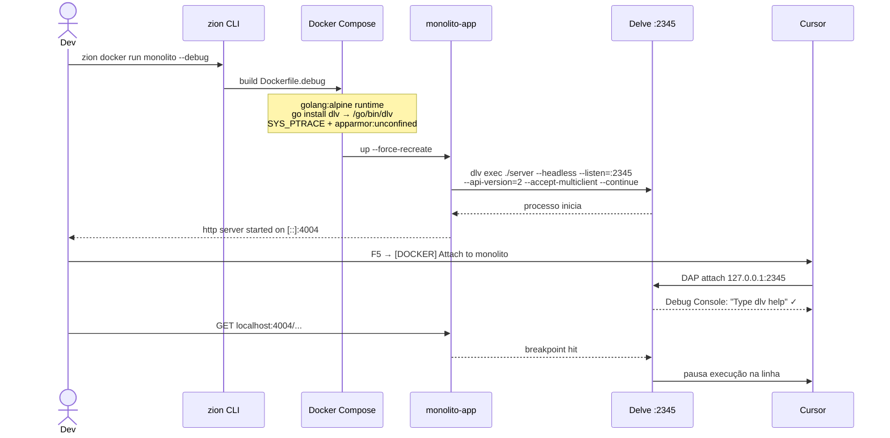

# Monolito — Docker config

Config Docker versionada para o monolito Go da estrategia.

## Servicos

- **app** — servidor HTTP (porta 4004) + Delve debugger (porta 2345)
- **worker** — worker de filas/jobs
- **postgres** — PostgreSQL 16
- **redis** — Redis 7
- **localstack** — SQS + S3 local

## Uso

```bash
zion docker run monolito              # sandbox (default)
zion docker run monolito --env=local  # dev local
zion docker run monolito --debug      # com Delve em :2345 (attach via Cursor/VS Code)
zion docker logs monolito -f          # follow logs
zion docker stop monolito             # para tudo
zion docker shell monolito            # shell no app
zion docker shell monolito postgres   # shell no postgres
```

## Arquitetura



## Fluxo debug



## Debug remoto (Cursor / VS Code)

1. Subir em modo debug:
   ```bash
   zion docker run monolito --debug
   ```
2. Aguardar `API server listening at: [::]:2345` nos logs
3. No Cursor/VS Code: F5 → `[DOCKER] Attach to monolito`

**Como funciona:**
- `Dockerfile.debug` — build com `-gcflags="all=-N -l"` (sem otimizacoes), runtime usa `golang:1.24.4-alpine` (tem dlv)
- `docker-compose.debug.yml` — override com `SYS_PTRACE` + `apparmor:unconfined` (obrigatorio para dlv)
- dlv roda: `dlv exec ./server --headless --listen=:2345 --api-version=2 --accept-multiclient --continue`
- dlv binario fica em `/go/bin/dlv` (GOPATH da imagem golang:alpine)
- launch.json: `request=attach, mode=remote, substitutePath: workspaceFolder→/go/app`

## Env files

- `env/sand.env` — sandbox (deps em containers, endpoints locais)
- `env/local.env` — localhost (deps no host, LOG_LEVEL=debug)
- `env/qa.env` — QA
- `env/prod.env` — template producao (segredos via .env.local)

## Path do projeto

Configurar em `~/.zion`:
```bash
MONOLITO_DIR="$HOME/projects/estrategia/monolito"
```

## Detalhes tecnicos

- Go 1.24.4, `CGO_ENABLED=1`, `-tags musl` (necessario para librdkafka)
- Build usa `vendor/` (gerado por `zion docker install monolito`)
- Entrypoints: `./cmd/server/main.go` e `./cmd/worker/main.go`
- 6 verticais: concursos, medicina, oab, vestibulares, militares, carreiras-juridicas
- Erros normais no boot (nao criticos): Coruja-AI endpoint, cloudfront private key, Toggler JSON

## Logs

- Host: `~/.local/share/zion/logs/monolito/`
- Container (zion edit): `/workspace/logs/docker/monolito/`
- Arquivos: `service.log`, `startup.log`, `deps.log`, `install.log`
