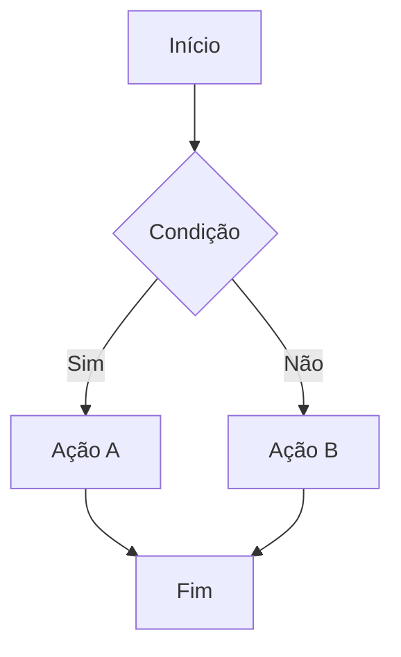
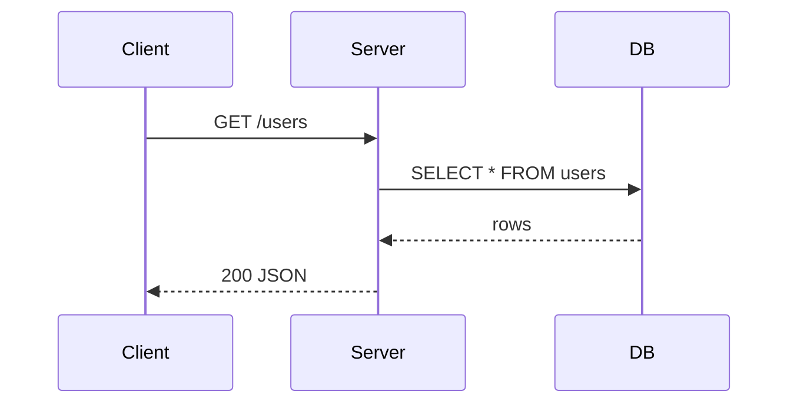
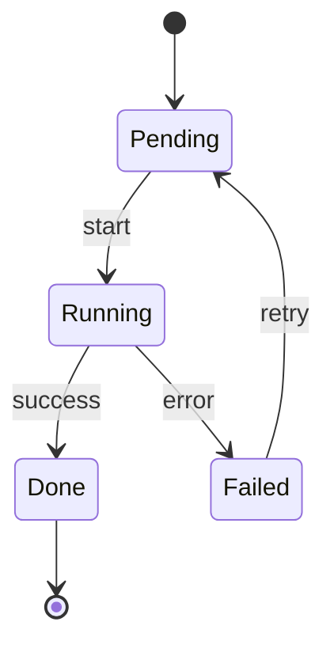
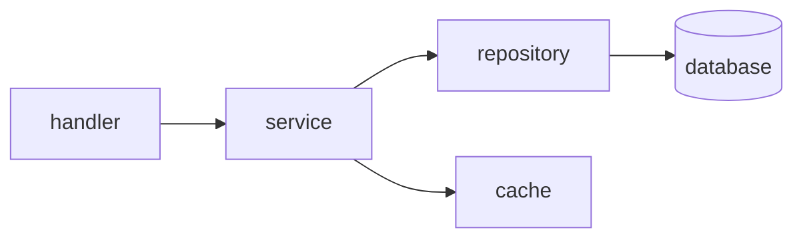
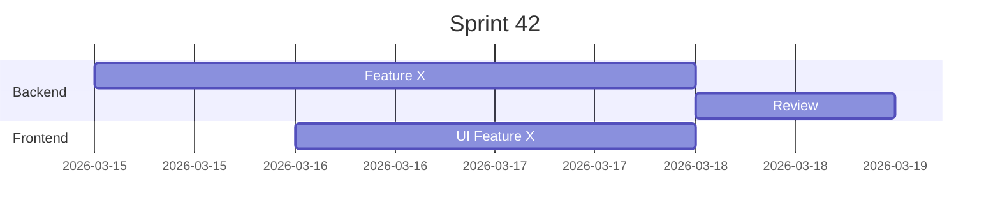
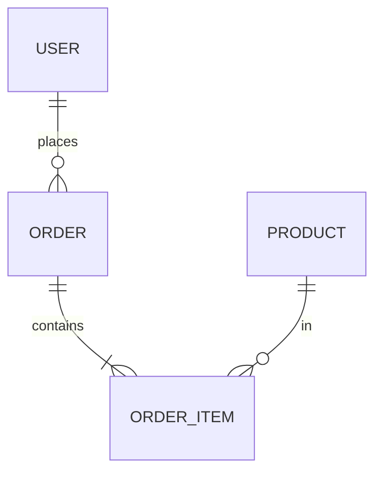

# Skill: draw — ASCII Art & Diagramas

> Referência para desenhar diagramas, fluxos, grafos e arquitetura.
> Decide automaticamente entre ASCII puro vs Mermaid conforme o contexto de renderização.

---

## Draw Server (Zion) — desenhar no browser

Servidor HTTP que renderiza Mermaid + Markdown em tempo real. O **agente** é quem roda e reinicia o servidor.

**Esta seção é a referência principal para o draw server.** Use-a quando for a única fonte carregada; aqui estão o fluxo, os paths, as portas e as lições aprendidas.

### Host e URL

- **Host:** use **`zion`** (não localhost). O usuário configurou redirect de `zion` para localhost.
- **Formato do link:** `http://zion:PORT` (ex.: `http://zion:8765`, `http://zion:8766`).
- Ao falar com o usuário, sempre usar **zion:porta**; nunca "localhost" na mensagem.

### Portas

- O servidor tenta **8765**, depois **8766**, depois **8767** (fallback se a porta estiver ocupada).
- Ao iniciar, o script imprime no stderr a URL real (ex.: `Draw server: http://zion:8766 (content: ...)`). Use **sempre essa porta** ao informar o usuário.

### Quem roda e reinicia o servidor

- **O agente.** Se você alterar o código do draw-server (ex.: título, layout, SSE), **você** deve reiniciar o servidor para a mudança refletir.
- Iniciar: `python3 /zion/scripts/draw-server.py &`
- Reiniciar: matar o processo (ex.: `pkill -9 -f draw-server.py`) e iniciar de novo, ou só iniciar — o script usa fallback de portas e sobe na primeira livre.

### Conteúdo e path

- **Arquivo único:** `/workspace/mnt/.zion-draw/content.md` (ou `$WORKSPACE/.zion-draw/content.md`).
- O agente escreve com a ferramenta **Write**. Path configurável por env `ZION_DRAW_CONTENT`.
- A página lê esse arquivo e re-renderiza quando ele muda.

### Atualização em tempo real

- **Server-Sent Events (SSE):** GET `/stream`. O servidor observa o `mtime` do arquivo a cada ~0,3s e envia o conteúdo quando muda. Não é polling no cliente; a página usa **EventSource** e recebe eventos em tempo real. Se a conexão cair, reconecta automaticamente.
- No canto da página: status **"ao vivo"** (conectado) ou **"reconectando…"**.

### Página servida

- **Sem header** "Zion Draw"; título da aba é só **"Draw"**.
- Só o bloco de conteúdo (Mermaid + Markdown) e o status de conexão no canto.

### Como informar o usuário

- **Sempre** mostrar o link numa **caixa** (bloco de código ou box ASCII) para o usuário copiar/abrir.
- Exemplo de frase: *"Servidor no ar. Abra o link abaixo no browser para ver os desenhos:"*
- Exemplo de caixa:

  ```
  ┌─────────────────────────────┐
  │  http://zion:8766            │
  └─────────────────────────────┘
  ```

  Ou em bloco de código: `` `http://zion:8766` ``. Usar a porta que o servidor imprimiu ao subir.

### Fluxo resumido

1. **Levantar ou verificar** o servidor (se a URL não responder, iniciar com `python3 /zion/scripts/draw-server.py &`).
2. **Escrever** o conteúdo em `/workspace/mnt/.zion-draw/content.md` (Mermaid em blocos ` ```mermaid `, resto Markdown).
3. **Avisar** o usuário com o link **em caixa**, usando a URL que o servidor indicou (ex.: http://zion:8766).

### Onde está no repo

| Item | Caminho |
|------|--------|
| Script do servidor | `zion/scripts/draw-server.py` |
| Instruções do agente | `zion/system/CLAUDE.OVERRIDE.md` (seção 4) |
| Comando de referência | `zion/commands/tools/draw.md` |

### Lições aprendidas (Draw Server)

- **Mudança no código não refletiu na página?** Quem serve o HTML é o processo do servidor. Se você alterou `draw-server.py`, **você** precisa reiniciar o servidor (pkill + iniciar de novo ou só iniciar em outra porta). O usuário não vê alteração até o servidor ser reiniciado.
- **Porta em uso (Address already in use):** O script tenta 8765 → 8766 → 8767. Não precisa matar o processo manualmente para “liberar”; inicie de novo e use a URL que o servidor imprimir (ex.: http://zion:8766). Avise o usuário para abrir **essa** URL.
- **Sempre use o host `zion`** na mensagem ao usuário. Ele configurou redirect (ex.: /etc/hosts) de `zion` para localhost. Se você disser "localhost:8766", o usuário pode estar acostumado a abrir "zion:8766"; mantenha consistência.
- **Link em caixa sempre.** Não basta escrever o link no texto. Coloque numa caixa (bloco de código ou box ASCII) para o usuário copiar/colar ou clicar com facilidade.
- **Quem roda o servidor é você.** Em sessões Zion, o agente é quem inicia e reinicia o draw server. Se o usuário pedir "reabra", "reinicie" ou "levanta o servidor", execute o comando (iniciar ou pkill + iniciar).
- **Chrome bloqueia portas “inseguras”.** Por isso a porta não é 6666; usamos 8765 (e 8766, 8767 como fallback). Evite portas tipo 6665–6669 em novos serviços web para o browser.
- **Conteúdo vazio ou “Aguardando conteúdo…”?** O arquivo pode não existir ainda. O agente deve escrever em `/workspace/mnt/.zion-draw/content.md`; o servidor cria o diretório `.zion-draw` se não existir. Após o Write, a página atualiza em tempo real via SSE.

---

## Matriz de Renderização

| Contexto | ASCII/Box-drawing | Mermaid | Notas |
|----------|:-----------------:|:-------:|-------|
| **Claude Code terminal** | ✅ renderiza | ❌ não renderiza — mostra código bruto | Sempre usar ASCII no terminal |
| **Obsidian vault** | ✅ | ✅ renderiza nativamente | Preferir Mermaid pra diagramas complexos |
| **GitHub markdown** | ✅ | ✅ (desde 2022) | Mermaid funciona em `.md` no GitHub |
| **Claude.ai web** | ✅ | ✅ renderiza | Interface web renderiza Mermaid |
| **Arquivos `.md` locais** | ✅ | depende do viewer | Assumir que não renderiza, a menos que seja Obsidian/GitHub |

**Regra geral:**
- Interativo no terminal → **ASCII puro**
- Obsidian Obsidian / arquivo `.md` que vai pro GitHub → **Mermaid permitido**
- Dúvida sobre o contexto → perguntar ou usar ASCII (sempre funciona)

---

## ASCII — Referência de Padrões

### Caixas simples

```
┌─────────────┐    ╔═════════════╗    ╭─────────────╮
│  conteúdo   │    ║  conteúdo   ║    │  conteúdo   │
└─────────────┘    ╚═════════════╝    ╰─────────────╯
  simples             dupla              arredondada
```

### Fluxo linear

```
┌──────┐     ┌──────┐     ┌──────┐     ┌──────┐
│  A   │────▶│  B   │────▶│  C   │────▶│  D   │
└──────┘     └──────┘     └──────┘     └──────┘
```

### Fluxo com decisão (diamond)

```
              ┌──────┐
              │ START│
              └──┬───┘
                 │
              ┌──▼───┐
         ┌────│  ?   │────┐
         │ Sim└──────┘Não │
         ▼                ▼
      ┌──────┐        ┌──────┐
      │ Ação │        │ Skip │
      └──┬───┘        └──┬───┘
         └──────┬─────────┘
             ┌──▼───┐
             │ END  │
             └──────┘
```

### Grafo / Árvore

```
app
├── cmd/
│   └── main.go
├── internal/
│   ├── handler/
│   │   ├── user.go
│   │   └── auth.go
│   └── service/
│       └── user.go
└── pkg/
    └── util.go
```

### Tabela de dados

```
┌────────────┬──────────┬─────────┐
│ Campo      │ Tipo     │ Null    │
├────────────┼──────────┼─────────┤
│ id         │ bigint   │ NO      │
│ name       │ varchar  │ NO      │
│ created_at │ timestmp │ YES     │
└────────────┴──────────┴─────────┘
```

### Sequência/Timeline

```
 t=0         t=1         t=2         t=3
  │           │           │           │
  ├──[init]──▶├──[load]──▶├──[proc]──▶├──[done]
  │           │           │           │
```

### Seta estilo de comunicação (request/response)

```
Client          Server          DB
  │──── GET /──────▶│            │
  │                 │──── SQL ──▶│
  │                 │◀─── rows ──│
  │◀──── 200 ───────│            │
```

### Barra de progresso

```
[████████████████░░░░]  80%
[████████░░░░░░░░░░░░]  40%
[░░░░░░░░░░░░░░░░░░░░]   0%
```

### Pipeline horizontal

```
┌─────┐   ┌─────┐   ┌─────┐   ┌─────┐
│ SRC │──▶│ ETL │──▶│ DB  │──▶│ API │
└─────┘   └─────┘   └─────┘   └─────┘
```

### Layers/camadas

```
╔══════════════════════════╗
║         API Layer        ║
╠══════════════════════════╣
║       Service Layer      ║
╠══════════════════════════╣
║     Repository Layer     ║
╠══════════════════════════╣
║        Database          ║
╚══════════════════════════╝
```

### Grid/Matrix

```
     A    B    C    D
  ┌────┬────┬────┬────┐
1 │ ✓  │    │ ✓  │    │
  ├────┼────┼────┼────┤
2 │    │ ✓  │    │ ✓  │
  ├────┼────┼────┼────┤
3 │ ✓  │ ✓  │    │    │
  └────┴────┴────┴────┘
```

### Estado/Badge inline

```
● online     ○ offline     ◐ parcial
▲ warning    ✗ error       ✓ ok
```

---

## Mermaid — Referência (Obsidian / GitHub / Web)

### Flowchart

````markdown

````

### Sequência (request/response)

````markdown

````

### State Machine

````markdown

````

### Grafo de dependências

````markdown

````

### Gantt / Timeline

````markdown

````

### ER Diagram

````markdown

````

---

## Caracteres Úteis

| Categoria | Chars |
|-----------|-------|
| Box simples | `─ │ ┌ ┐ └ ┘ ├ ┤ ┬ ┴ ┼` |
| Box duplo | `═ ║ ╔ ╗ ╚ ╝ ╠ ╣ ╦ ╩ ╬` |
| Box arredondado | `╭ ╮ ╰ ╯` |
| Setas | `→ ← ↑ ↓ ↗ ↘ ↙ ↖ ▶ ◀ ▲ ▼` |
| Setas duplas | `⟶ ⟵ ⟷ ⇒ ⇐ ⇔` |
| Block chars | `█ ▓ ▒ ░ ▌ ▐ ▀ ▄` |
| Status | `● ○ ◐ ✓ ✗ ▲ ◆ ◇` |
| Triângulos | `▶ ▷ ▸ ▹ ◂ ◃ ◁ ◀` |
| Outros | `· • ‣ ⋮ ⋯ ⸺ — –` |

---

## Regras de Uso

1. **Contexto terminal sempre → ASCII**. Nunca usar Mermaid em respostas interativas do Claude Code.
2. **Mermaid para obsidian/docs** — ao criar arquivos `.md` pro Obsidian Obsidian ou GitHub, preferir Mermaid para diagramas complexos (sequência, ER, state machine).
3. **ASCII ≥ Mermaid** para coisas simples — uma caixa com setas é mais legível como ASCII do que como Mermaid de 3 linhas.
4. **Consistência de estilo** — usar box-drawing Unicode (não `+`, `-`, `|` ASCII puro) para melhor alinhamento visual.
5. **Code block obrigatório** — SEMPRE envolver diagramas ASCII em ` ```text ` ou ` ``` ` para preservar espaçamento monospace.

---

## Pitfalls & Anti-patterns

> Problemas reais observados em produção (screenshots 2026-03-15).

### Anti-pattern 1: Mix de estilos single + double (BREAKING)

**O que aparece:** borda direita com `║` enquanto o resto usa `─` e `┌┐└┘`. Canto incompatível.

```
❌  ┌────────────┐
    │ content    ║  ← single canto + double lateral = QUEBRADO
    └────────────╝

✅  ┌────────────┐    ╔════════════╗
    │ content    │    ║ content    ║
    └────────────┘    ╚════════════╝
    (tudo single)     (tudo double)
```

**Causa:** LLM muda de família de caracteres no meio da geração.

**Regra:** Decidir família UMA VEZ antes de começar. Se usou `┌`, usar `─ │ ┐ └ ┘ ├ ┤ ┬ ┴ ┼` até o fim. Se usou `╔`, usar `═ ║ ╗ ╚ ╝ ╠ ╣ ╦ ╩ ╬` até o fim.

---

### Anti-pattern 2: Borda direita duplicada (`│` extra ou `││`)

**O que aparece:** o lado direito da caixa tem dois pipes ou pipe largo.

```
❌  ┌──────────────┐
    │ item longo   ││  ← dois pipes! erro de contagem
    └──────────────┘

✅  ┌────────────────┐
    │ item longo     │  ← um pipe, largura calculada antes
    └────────────────┘
```

**Causa:** conteúdo mais longo que a largura planejada — LLM compensa com `│` extra.

**Regra:** Calcular largura ANTES. Pegar o texto mais longo, somar padding fixo (`1 espaço + conteúdo + 1 espaço`), usar esse valor para a linha `─`. Nunca recalcular por linha.

**Como calcular:**
```
Conteúdo mais longo: "cache-or-fetch" = 14 chars
Padding:              1 + 14 + 1      = 16 chars
Linha horizontal:     ─ × 16
Linha de conteúdo:    │ + " " + texto + padding_espaços + " " + │
Total por linha:      │ (1) + 16 + │ (1) = 18 chars
```

---

### Anti-pattern 3: Largura inconsistente — borda direita "torta"

**O que aparece:** o `│` direito aparece em colunas DIFERENTES em linhas diferentes. Parece uma borda ondulada/torta, ou a caixa "se abre" no lado direito.

```
❌  ┌──────────────────────────────┐
    │ services/  repositories/    │   ← │ na col 32
    │                             │
    │       ▼                     │
    │  cache-or-fetch flow        │   ← │ na col 28 (TORTO!)
    └──────────────────────────────┘
```

**Causa:** as linhas de conteúdo têm comprimentos diferentes. O `│` fecha na posição do texto, não na posição da borda.

**Regra:** CADA linha de conteúdo deve ser preenchida com espaços até ocupar exatamente `MAX_WIDTH` chars antes do `│` direito.

```
✅  passo 1: calcular MAX_WIDTH
    conteúdo mais largo = "services/  repositories/" = 26 chars
    padding = 1+26+1 = 28 chars de inner width

    passo 2: TODA linha usa o mesmo inner width
    ┌────────────────────────────┐   ← 28 dashes
    │ services/  repositories/  │   ← 1 + 26 + 1 espaço = 28 ✓
    │                            │   ← 1 + 26 espaços + 1  = 28 ✓
    │       ▼                    │   ← 1 + 6 + 21 espaços + 0 = 28 ✓
    │  cache-or-fetch flow       │   ← 1 + 1 + 20 + 6 espaços = 28 ✓
    └────────────────────────────┘   ← 28 dashes
```

**Regra prática:** Contar a linha mais longa. Todas as outras → padding de espaços até o mesmo comprimento ANTES do `│` direito. O `│` direito é sempre na mesma coluna.

---

### Anti-pattern 4: Conectores incompatíveis com o estilo

```
❌  ┌─────────┬──────┐
    │ A       │ B    │
    ╠═════════╬══════╣  ← conector double em box single!
    │ X       │ Y    │
    └─────────┴──────┘

✅  ┌─────────┬──────┐    ╔═════════╦══════╗
    │ A       │ B    │    ║ A       ║ B    ║
    ├─────────┼──────┤    ╠═════════╬══════╣
    │ X       │ Y    │    ║ X       ║ Y    ║
    └─────────┴──────┘    ╚═════════╩══════╝
```

**Regra:** Conectores internos herdam o estilo:
- Single externo (`┌┐└┘`) → internos single (`├ ┤ ┬ ┴ ┼`)
- Double externo (`╔╗╚╝`) → internos double (`╠ ╣ ╦ ╩ ╬`)

---

### Tabela de famílias (referência rápida)

| Posição | Single | Double | Rounded |
|---------|:------:|:------:|:-------:|
| Canto ↖ | `┌` | `╔` | `╭` |
| Canto ↗ | `┐` | `╗` | `╮` |
| Canto ↙ | `└` | `╚` | `╰` |
| Canto ↘ | `┘` | `╝` | `╯` |
| Horizontal | `─` | `═` | `─` |
| Vertical | `│` | `║` | `│` |
| T esquerdo | `├` | `╠` | — |
| T direito | `┤` | `╣` | — |
| T cima | `┬` | `╦` | — |
| T baixo | `┴` | `╩` | — |
| Cruz | `┼` | `╬` | — |

> Rounded usa `╭╮╰╯` nos cantos mas `─` e `│` nas linhas — é uma família especial (cantos arredondados + linhas single). Não misturar cantos rounded com double.

---

### Checklist antes de finalizar um box

```
[ ] Família escolhida e declarada mentalmente (single / double / rounded)?
[ ] Todos os cantos do mesmo grupo?
[ ] Todas as horizontais do mesmo grupo (─ ou ═)?
[ ] Todas as verticais do mesmo grupo (│ ou ║)?
[ ] Conectores internos do mesmo grupo?
[ ] Borda direita: apenas UM char por linha, nunca││?
[ ] Largura: mesma em todas as linhas horizontais?
[ ] Padding interno: só espaço U+0020, nunca ZWS U+200B?
```

---

## Learning Log

> Atualizar este log quando descobrir novo comportamento de renderização.

| Data | Descoberta | Contexto |
|------|-----------|----------|
| 2026-03-15 | Mermaid NÃO renderiza no Claude Code terminal — mostra código bruto | Investigação inicial |
| 2026-03-15 | Obsidian renderiza Mermaid nativamente (confirmado em obsidian-reference.md) | Obsidian Obsidian |
| 2026-03-15 | GitHub renderiza Mermaid em `.md` desde 2022 | GitHub |
| 2026-03-15 | Claude.ai web renderiza Mermaid | Interface web |
| 2026-03-17 | Draw Server (Zion): host **zion** (redirect localhost), portas 8765→8766→8767, SSE em /stream, conteúdo em .zion-draw/content.md. Agente roda e reinicia o servidor; ao informar usuário, link em caixa (http://zion:PORT). Página sem header, título "Draw". | Draw server no Zion |
